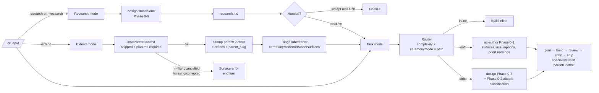

# cclaw

**A multi-stage planning + review harness for coding agents.**

cclaw drops a `/cc` slash command into Claude Code, Cursor, OpenCode, or Codex. It routes the task, picks the right amount of ceremony, and runs the work through a fixed pipeline: route → plan → build → qa → review → critic → ship. Each stage emits a slim summary back to the harness and writes a tracked artifact under `.cclaw/flows/<slug>/`. Sub-agents are isolated; the orchestrator keeps the slug's history.

cclaw installs `/cc` and `/cc-cancel` into each harness. Inside `/cc`, three entry modes cover task work, research, and continuation flows — see [When to use which command](#when-to-use-which-command) and [Modes](#modes).

## Why cclaw

- **Pipeline, not autopilot.** Every stage pauses at a structured gate so the human can read the artifact, edit it, or `/cc-cancel`. There is no "let it run for an hour and hope".
- **Two-model review.** A read-only reviewer walks ten axes; an adversarial critic falsifies what the reviewer cleared. They share no context and write to separate artifacts (`review.md`, `critic.md`).
- **Right-sized ceremony.** Trivial edits run inline (one commit, no plan). Small/medium tasks get a soft-mode plan and a single TDD cycle. Large-risky tasks get a full per-criterion build with a pre-implementation plan-critic gate.
- **Lightweight router.** The routing hop is zero-question by default (no structured ask, no clarifying prompt). Explicit override flags (`/cc --inline <task>` / `/cc --soft <task>` / `/cc --strict <task>`) short-circuit the heuristic when you want to pin a ceremony level. Classification work (surface detection, assumption capture, prior-learnings, interpretation forks) moved into the specialist that already has the codebase context — `design` Phase 0-2 on strict, `ac-author` Phase 0-1 on soft.
- **Research mode.** `/cc research <topic>` is a separate entry point for pre-task uncertainty: brainstorming, scope exploration, architecture comparison. Runs the `design` specialist standalone (Phase 0 Bootstrap → Phase 6 Compose), emits a `research.md` synthesis artifact, and stops. Optional handoff into a follow-up `/cc <clarified task>` flow that consumes the research as `priorResearch` context.
- **Continuation flow.** `/cc extend <slug> <task>` loads a previously-shipped slug as parent context for iterative work that explicitly builds on a previously-shipped slug. Loads the parent's `plan.md` / `build.md` / `learnings.md` (and `review.md` / `critic.md` / `qa.md` when present) into `flowState.parentContext`. Triage inherits `ceremonyMode` / `runMode` / `surfaces` from the parent (explicit `--strict` / `--soft` / `--inline` flags still override). The new flow's `plan.md` carries a `## Extends` section + `parent_slug:` frontmatter that points back at the parent.
- **Same runtime, four harnesses.** Claude Code, Cursor, OpenCode, and Codex all read the same `.cclaw/` install. Each harness gets the same `/cc` body plus harness-namespaced ambient rules.
- **Compound learnings.** Non-trivial slugs emit a `learnings.md`. Future runs read prior shipped lessons through `knowledge.jsonl` before authoring a plan; outcome signals (`good` / `unknown` / `manual-fix` / `follow-up-bug` / `reverted`) down-weight priors that didn't hold up.

## When to use which command

| Intent | Command | What it does |
| --- | --- | --- |
| Execute a task end-to-end (code change) | `/cc <task>` | Full flow: triage → plan → build → review → critic → ship |
| Think / brainstorm / research a topic without committing to a task | `/cc research <topic>` | Standalone exploration; outputs `research.md`; optional handoff to `/cc <task>` |
| Extend a previously-shipped slug with related work | `/cc extend <slug> <task>` | New flow with parent's plan/build/learnings loaded as context |
| Cancel the active flow | `/cc-cancel` | Discards current `.cclaw/flows/<slug>/`, frees the orchestrator |

## Quickstart

```bash
cd /path/to/your/repo
npx cclaw-cli@latest

# Inside your harness:
/cc add caching to the search endpoint

# After cclaw pauses at a gate, type /cc again to resume.
# Artifacts land in .cclaw/flows/<slug>/.
ls .cclaw/flows/20260515-search-caching/
# plan.md  build.md  review.md  critic.md  ship.md
```

For CI / scripted installs, use the non-interactive escape hatch:

```bash
npx cclaw-cli@latest --non-interactive install --harness=cursor
```

There is no `cclaw plan`, `cclaw build`, or `cclaw status`. Flow control lives inside `/cc`.

## Modes

v8.59 ships three top-level entry points. All invocations use the same `/cc` slash-command surface; the orchestrator picks which mode to run based on the first token after `/cc`.

### `/cc <task>` — task mode (the historical default)

Runs the full route → plan → build → ship pipeline with all the gates. The router (formerly "triage") is zero-question by default — it picks `complexity` × `ceremonyMode` × `path` from heuristics and announces the choice in one line, then dispatches the first specialist. No clarifying questions; no structured ask. If you want to pin a ceremony level explicitly, pass one of:

```bash
/cc --inline <task>    # forces inline edit (one commit, no plan)
/cc --soft <task>      # forces soft-mode plan → build → review → ship
/cc --strict <task>    # forces strict + design Phase 0-7 + per-criterion commits + plan-critic gate
```

The flags are mutually exclusive and orthogonal to the `--mode=auto` / `--mode=step` runMode toggle (`/cc --strict --mode=auto <task>` is valid). When the project has no `.git/`, the router auto-downgrades strict → soft even with `--strict` (per-criterion commits need a SHA chain to be useful).

What used to live at the router — surface detection, assumption capture, prior-learnings lookup, interpretation forks — now lives inside the specialist that has the codebase context to do it well: `design` Phase 0-2 (strict), `ac-author` Phase 0-1 (soft), nothing (inline). Pre-v8.58 state files continue to validate verbatim; readers default to `mode: "task"` when the field is absent.

### `/cc research <topic>` — research mode (v8.58 new entry point)

Runs the `design` specialist in standalone activation mode — same Phase 0-6 as the in-flow brainstormer (Bootstrap → Clarify → Frame → Approaches → Decisions → Pre-mortem → Compose), but stops at Compose. Output: `.cclaw/flows/<slug>/research.md`. No build / review / critic / ship. The Phase 7 picker is a two-option `accept research` / `revise` (instead of the intra-flow three-option `approve` / `request-changes` / `reject`).

```bash
/cc research storage strategy for shared agent memory
/cc --research auth library trade-offs                 # equivalent
```

After accepting the research, the orchestrator surfaces a plain-prose handoff:

> Ready to plan? Run `/cc <clarified task description>` and I'll carry the research forward as context.

The next `/cc <task>` invocation on the same project reads `flow-state.json > priorResearch` and consumes the most-recent shipped research as input to its plan stage (design Phase 0 / ac-author Phase 0 include the research artifact in their reads). The handoff is optional — if you accept the research and never run a follow-up `/cc`, nothing else fires.

Research mode skips the router entirely. There is no triage gate; no `complexity` / `ceremonyMode` heuristic runs. The orchestrator stamps a sentinel triage block (`mode: "research"`, `ceremonyMode: "strict"`, `path: ["plan"]`) so downstream readers that assume `triage` is present continue to work.

### `/cc extend <slug> <task>` — continuation mode (v8.59 new entry point)

Initialises a new flow that explicitly **extends a previously-shipped slug**. The orchestrator loads the parent's `plan.md`, `build.md`, `learnings.md`, and (when present) `review.md` / `critic.md` / `qa.md` as `flowState.parentContext` and surfaces them to design / ac-author / reviewer / critic as load-bearing context. Things already settled by the parent are NOT re-decided in the new flow.

```bash
/cc extend 20260514-auth-flow add SAML login                   # canonical
/cc extend 20260514-auth-flow --strict refactor session store  # ceremony override wins over inheritance
/cc extend 20260514-cli-help --mode=auto fix typo in --help    # runMode override wins
```

The orchestrator runs the same pipeline as a standard `/cc <task>` (plan → build → qa? → review → critic → ship); the only difference is at init:

- **Parent validation.** `loadParentContext(projectRoot, <slug>)` (`src/parent-context.ts`) confirms the slug is shipped + has a non-empty `plan.md`. Four failure modes are explicit: `in-flight` (slug still active), `cancelled` (under `flows/cancelled/`), `corrupted` (shipped but `plan.md` missing), `missing` (slug not found anywhere). Each surfaces a one-line error and ends the turn.
- **State stamp.** The new flow's `flow-state.json > parentContext` carries the parent's slug + status + shippedAt + structured artifact paths. Plan.md frontmatter carries `parent_slug: <parent>` (v8.59-native) plus `refines: <parent>` (back-compat with the knowledge-store chain, qa-runner skip rule, plan-critic skip gate, design Phase 6 brownfield path).
- **Triage inheritance.** The new flow's `ceremonyMode` / `runMode` / `surfaces` default to the parent's values. Explicit `--strict` / `--soft` / `--inline` / `--mode=auto` / `--mode=step` flags override inheritance. A security-keyword escalation heuristic (`security` / `auth` / `migration` / `schema` / `payment` / `gdpr` / `pci`) auto-escalates a soft/inline parent → strict for the new flow.
- **Specialist consumption.** `design` Phase 0 reads parent's `## Spec` / `## Decisions` / `## Selected Direction` and surfaces "Building on prior decisions: …". `ac-author` Phase 1.7 authors a mandatory `## Extends` section at the top of `plan.md` with parent slug + 1-line decision summary + clickable links to parent artifacts. `reviewer` runs a lightweight parent-contradictions cross-check (silent reversals of a parent D-N are `required` findings). `critic` §3 adds a skeptic question on parent decision contradictions.
- **Knowledge-store integration.** When `parentContext` is set, `findNearKnowledge` prepends the parent's `knowledge.jsonl` entry to the top of the prior-learnings result (load-bearing context overrides Jaccard ranking).

v8.59 loads the **immediate** parent only — multi-level chains (`grandparent → parent → child`) are not auto-walked. Specialists may use `findRefiningChain` on demand when transitive context is needed; multi-level auto-loading at orchestrator level is v8.60+ scope.



## Worked example

You type:

```text
/cc add caching to the search endpoint
```

The orchestrator runs through these stages in order, pausing at each gate. The slim-summary blocks the orchestrator emits sit under `## Triage`, `## Plan`, `## Build`, `## QA`, `## Review`, `## Critic`, `## Ship` section headers in chat. Artifacts land on disk.

- **Triage (lightweight router).** complexity: small-medium · ceremony mode: soft · path: plan → build → review → critic → ship · slug: `20260515-search-caching` · mode: task. The router runs zero-question by default — no clarifying ask. The decision is persisted to `flow-state.json > triage` and is immutable for the slug. (v8.58 — surface detection / assumption capture / prior-learnings lookup moved into `ac-author` Phase 0-1 on the soft path; they used to live here.)
- **Plan.** `ac-author` writes `plan.md` — Spec section (Objective / Success / Out of scope / Boundaries), Frame, Acceptance Criteria, Edge cases, Topology, Feasibility stamp, Traceability block. 3 AC, 2 prior lessons surfaced from `knowledge.jsonl`. Confidence: high.
- **Build.** `slice-builder` runs one TDD cycle per criterion: RED → GREEN → REFACTOR. Each commit carries an `AC-N` prefix the reviewer reads via `git log --grep`. Tests: 14 passing (was 11). Coverage delta: +2.3%.
- **Review.** Ten-axis reviewer opens 2 findings on the first iteration: cache-key collision on case-sensitive queries (`correctness`, `required`) and missing TTL refresh on stale entries (`architecture`, `consider`). Fix-only re-review closes both findings.
- **Critic.** Adversarial falsificationist pass — predictions, gap analysis, Criterion check across AC + Edge cases + NFR rows, goal-backward verification, realist check. Verdict: pass.
- **Ship.** All 3 AC committed. `ship.md` carries the release-notes draft and the AC↔commit map. The picker asks before pushing.

After ship, the orchestrator moves the artifacts to `.cclaw/flows/shipped/<slug>/` and (when the slug earned capture) appends one row to `.cclaw/state/knowledge.jsonl`.

## What you get

| Surface | Count + detail |
| --- | --- |
| **Specialists** | 8 sub-agents: `design` (two activation modes — intra-flow brainstormer for strict large-risky tasks, standalone researcher for `/cc research <topic>`; same Phase 0-6, only Phase 7 picker differs), `ac-author` (absorbs classification work on the soft path: Phase 0 assumption capture, Phase 1.5 surface detection), `plan-critic` (pre-implementation gate, strict + complexity≠trivial + AC≥2), `slice-builder`, `qa-runner` (UI/web surfaces, ceremonyMode≠inline), `reviewer`, `security-reviewer`, `critic` (post-implementation adversarial pass). Each runs in isolation with a mandatory contract read. |
| **Research helpers** | `repo-research` (brownfield scan) and `learnings-research` (prior shipped lessons) dispatched in parallel before every plan. |
| **Ceremony modes** | `strict` (per-criterion RED → GREEN → REFACTOR + AC↔commit chain), `soft` (single feature-level TDD cycle, plain commit), `inline` (one commit, no plan). Triage picks the mode; readers accept the legacy `acMode` key for one release. |
| **Plan template** | 14 sections (`Frame`, `Non-functional`, `Approaches`, `Selected Direction`, `Decisions`, `Pre-mortem`, `Not Doing`, `Plan`, `Spec`, `Acceptance Criteria`, `Feasibility stamp`, `Edge cases`, `Topology`, `Traceability block`) in strict mode; 6 sections (`Plan`, `Spec`, `Testable conditions`, `Verification`, `Touch surface`, `Notes`) in soft mode. AC is one section among many. |
| **Postures** | 6 per-criterion postures (`test-first`, `characterization-first`, `tests-as-deliverable`, `refactor-only`, `docs-only`, `bootstrap`). Each maps to a fixed commit-shape recipe the reviewer enforces ex-post. |
| **Review** | 10 reviewer axes — 8 base (`correctness`, `readability`, `architecture`, `security`, `perf`, `test-quality`, `complexity-budget`, `edit-discipline`) plus 2 gated (`qa-evidence` when qa-runner ran, `nfr-compliance` when `## Non-functional` is non-empty). Append-only findings table, convergence detector, severity-aware ship gate. |
| **Critic step** | Falsificationist pass after review clears: §1 predictions, §2 gap analysis, §3 four adversarial techniques + 6 human-perspective lenses (executor / stakeholder / skeptic for plan-stage, security / new-hire / ops for code-stage; adversarial mode only), §4 Criterion check (AC + Edge cases + NFR), §5 goal-backward, §6 realist check, §7 verdict, §8 summary. |
| **Auto-trigger skills** | 21 skills (`triage-gate`, `plan-authoring`, `tdd-and-verification`, `review-discipline`, `commit-hygiene`, `completion-discipline`, `pre-edit-investigation`, `qa-and-browser`, `debug-and-browser`, `ac-discipline`, `source-driven`, `summary-format`, `documentation-and-adrs`, `parallel-build`, `refinement`, `flow-resume`, `receiving-feedback`, `anti-slop`, `conversation-language`, `api-evolution`, `pre-flight-assumptions`). Auto-applied per stage, not user-invoked. |
| **On-demand runbooks** | 12 runbooks loaded by trigger (`dispatch-envelope`, `parallel-build`, `finalize`, `cap-reached-recovery`, `adversarial-rerun`, `handoff-gates`, `handoff-artifacts`, `compound-refresh`, `pause-resume`, `critic-steps`, `qa-stage`, `extend-mode`). Kept out of the orchestrator body to hold the prompt budget. |
| **Anti-rationalization catalog** | v8.49 — `.cclaw/lib/anti-rationalizations.md` carries the cross-cutting rebuttal table (posture-bypass, completion-discipline, edit-discipline, verification rows). Each specialist's prompt cites the catalog and adds its own specialist-specific rows. |
| **Outcome signals** | v8.50 — 5-value enum (`good`, `unknown`, `manual-fix`, `follow-up-bug`, `reverted`) recorded on `knowledge.jsonl` rows. Three capture paths (orchestrator scans on every `/cc` for follow-up-bug references; compound time scans for revert commits and same-touch-surface manual-fix commits). Prior-learnings lookup multiplies similarity by signal weight before threshold filtering. |
| **Ambiguity score** | v8.53 — design Phase 6 emits a composite ambiguity score (3 dims on greenfield, 4 dims on brownfield) into `plan.md` frontmatter. Phase 7 prefixes a soft warning when the composite exceeds threshold (default `0.2`, configurable). Informational signal, never a hard gate. |
| **Discipline skills** | v8.48 — `completion-discipline` (no `✅ complete` without paired fresh evidence), `pre-edit-investigation` (three-probe gate before any edit), `receiving-feedback` (slice-builder fix-only response protocol), plus the v8.48 `edit-discipline` reviewer axis. |
| **Harness-embedded rules** | v8.55 — every supported harness installs cclaw's Iron Laws + anti-rationalizations + antipatterns into its own ambient surface (`.cursor/rules/`, `.claude/`, `.codex/`, `.opencode/`). cclaw never touches root `AGENTS.md`, `CLAUDE.md`, or `GEMINI.md`. |
| **Parallel build** | Up to 5 slices on git worktrees when AC are independent and ≥2 touch-surface clusters. `ceremonyMode: strict` required. |
| **Multi-harness install** | Claude Code, Cursor, OpenCode, Codex — same `.cclaw/` runtime, different harness adapters. |

## Harnesses supported

| Harness | Detection | Status |
| --- | --- | --- |
| Claude Code | `CLAUDE.md` or `.claude/` | Supported |
| Cursor | `.cursor/` | Supported |
| OpenCode | `opencode.json[c]` or `.opencode/` | Supported |
| Codex | `.codex/` or `.agents/skills/` | Supported |

Run `npx cclaw-cli@latest` and the TUI auto-detects whatever you have. For CI / scripted installs, pass `--non-interactive install --harness=<id>[,<id>]` (comma-separated; supported ids: `claude`, `cursor`, `opencode`, `codex`).

## Configuration

`.cclaw/config.yaml` is optional. Defaults are good. Common knobs:

```yaml
harnesses: [claude, cursor]
reviewerTwoPass: false              # opt-in: spec-review + code-quality-review split
compoundRefreshEvery: 5             # how often to dedup knowledge.jsonl
compoundRefreshFloor: 10            # minimum entries before refresh kicks in
captureLearningsBypass: false       # true = silent skip on non-trivial slugs
legacy-artifacts: false             # true brings back v8.11-era extra artifacts
design:
  ambiguity_threshold: 0.2          # v8.53 — design Phase 7 soft warning threshold
```

## Architecture deep dive

The runtime is under 1 KLOC. The prompt content is where the work lives. If you want to understand how `/cc` actually works, read the source — the on-disk reference lives under `src/content/`:

- [`src/content/start-command.ts`](src/content/start-command.ts) — orchestrator body (detect, triage, dispatch, pause/resume, critic step, ship, compound, finalize).
- [`src/content/specialist-prompts/`](src/content/specialist-prompts/) — 8 specialist contracts.
- [`src/content/skills/`](src/content/skills/) — 21 auto-trigger skill bodies.
- [`src/content/runbooks-on-demand.ts`](src/content/runbooks-on-demand.ts) — 11 on-demand runbooks the orchestrator opens by trigger.
- [`src/content/artifact-templates.ts`](src/content/artifact-templates.ts) — plan / build / qa / review / critic / plan-critic / ship / learnings templates.
- [`src/content/anti-rationalizations.ts`](src/content/anti-rationalizations.ts) — cross-cutting rebuttal catalog (v8.49+).
- [`CHANGELOG.md`](CHANGELOG.md) — release history.

## Artifact tree (after install)

```
.cclaw/
  config.yaml               flow defaults
  state/
    flow-state.json         active flow state (~500 bytes)
    knowledge.jsonl         compound learnings index
    triage-audit.jsonl      v8.44 audit log
  flows/
    <slug>/                 one folder per active task
      plan.md
      build.md
      qa.md                 (v8.52+, UI/web slugs only)
      review.md
      critic.md             (v8.42+)
      plan-critic.md        (v8.51+, strict + complexity≠trivial + AC≥2)
      ship.md
      research.md           (v8.58+, /cc research <topic> only — design standalone synthesis)
    shipped/<slug>/         finalized tasks (including research-mode flows)
    cancelled/<slug>/       /cc-cancel destination
  lib/
    agents/                 8 specialist contracts
    skills/                 21 auto-trigger skill bodies
    templates/              artifact templates
    runbooks/               11 on-demand runbooks
    patterns/               reference patterns
    anti-rationalizations.md
    antipatterns.md
```

## CLI surface

Two invocations cover every use case. There is no `cclaw plan` / `cclaw status` / `cclaw build` / `cclaw ship` — flow control lives inside `/cc`. The bare subcommand surface (`init`, `sync`, `upgrade`) was retired in v8.29 + v8.37.

```bash
# Interactive (humans): opens a TUI menu — Install / Uninstall / Quit
npx cclaw-cli@latest

# Non-interactive (CI / scripts): explicit command, no TUI
npx cclaw-cli@latest --non-interactive install [--harness=<id>[,<id>]]
npx cclaw-cli@latest --non-interactive uninstall
npx cclaw-cli@latest --non-interactive knowledge [--tag=<tag>] [--surface=<sub>] [--type=<kind>] [--all] [--json]
npx cclaw-cli@latest --version
npx cclaw-cli@latest --help
```

`install` is idempotent and runs orphan cleanup, so it handles first-time setup, re-sync after a package upgrade, and stale-file cleanup in one command. The TUI menu and the `--non-interactive install` path share the same installer code — they are byte-for-byte identical in write behaviour.

## Contributing

cclaw is dogfooded — every release is shipped via `/cc` against itself. To contribute:

1. Fork and clone.
2. `npm install && npm run build && npm test` (the test suite is the spec; PRs without test updates are rare).
3. Run `/cc <your change>` inside a cclaw-installed harness, or write tests + code directly.
4. Open a PR. CI runs lint, typecheck, unit tests, integration tests, and a smoke runtime test.

The runtime stays under 1 KLOC; new behaviour usually means new prompt content under `src/content/`, not new code under `src/`.

## License

MIT. See [LICENSE](LICENSE).
