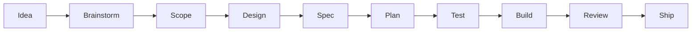
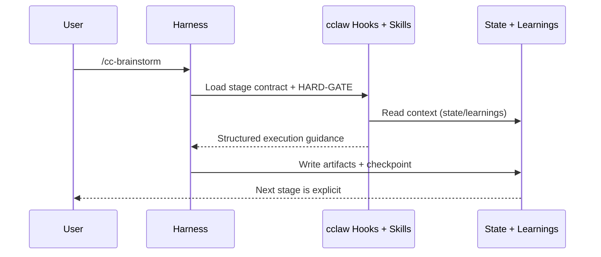

# cclaw

**A focused, installer-first workflow that turns AI coding sessions into predictable shipped outcomes.**

`cclaw` gives your agent one clear path:
**brainstorm -> scope -> design -> spec -> plan -> test -> build -> review -> ship**

No giant command jungle. No runtime daemon. No process theater.
Just a disciplined flow that stays lightweight and works across major coding harnesses.

## How It Works





## Why `cclaw` Wins In Practice

- **Low cognitive load:** one canonical stage flow instead of dozens of competing paths.
- **Installer-first architecture:** generates files and hooks; does not run a hidden control plane.
- **Hard-gated quality:** each stage has non-skippable constraints that reduce AI drift.
- **Cross-harness parity:** same behavior model across Claude Code, Cursor, Codex, OpenCode.
- **Compounding context:** flow state + learnings get rehydrated on new sessions automatically.
- **Run-scoped execution:** each flow works against an active run with explicit handoff state.

## Compared To Top References

| System | Strongest trait | Where `cclaw` is better |
|---|---|---|
| **Superpowers** | Rich skill ecosystem and mature workflows | Smaller operational surface, tighter stage discipline, faster onboarding for teams that want one default path |
| **G-Stack** | Deep multi-role orchestration (CEO/design/eng/release style) | Less overhead, fewer moving parts, easier to keep deterministic in day-to-day product delivery |
| **Everything Claude Code** | Broad command catalog and flexible patterns | Lower command entropy, clearer defaults, less decision fatigue for regular execution |

`cclaw` is intentionally opinionated: it optimizes for **signal over volume**.

## 60-Second Start

```bash
npx cclaw-cli init
```

Then run in your harness:

```text
/cc-brainstorm
```

Core installer lifecycle:

```bash
npx cclaw-cli sync
npx cclaw-cli doctor
npx cclaw-cli upgrade
npx cclaw-cli uninstall
```

## PR-First Ship Flow

`cclaw` does not run hidden git automation. It enforces release discipline inside the harness and keeps repository actions explicit.

Recommended shipping path:

```bash
git checkout main
git pull origin main
git checkout -b feat/<topic>
# implement with cclaw stages in the harness
git add .
git commit -m "..."
git push -u origin HEAD
gh pr create
```

After merge to `main`, CI handles release lifecycle:

- `Release Drafter` updates draft notes from merged PRs.
- `Release Publish` validates the build, publishes to npm (if version is new), and creates GitHub Release with generated notes.
- `Release Package` runs on published release and uploads `.tgz` and plugin manifests as artifacts.
- To trigger a new publish, bump `package.json` version in the PR before merge.

Required repository secret:

- `NPM_TOKEN` with publish access to the npm package.

## What Gets Generated

```text
.cclaw/
├── skills/
├── commands/
├── hooks/
├── templates/
├── artifacts/                # active mirror for current run (fallback path)
├── state/
├── runs/
│   └── <activeRunId>/
│       ├── artifacts/        # canonical run artifacts
│       ├── run.json
│       └── 00-handoff.md
└── learnings.jsonl
```

## License

[MIT](./LICENSE)
