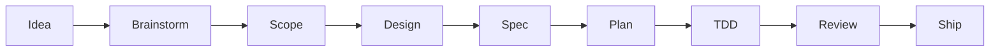
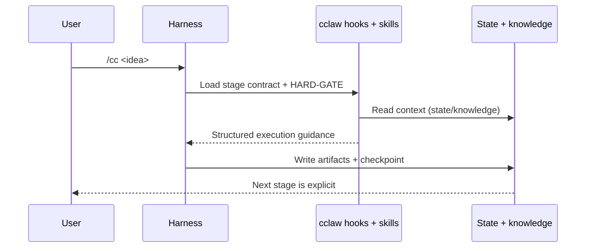

# cclaw

**Install once, ship every time.** cclaw is an installer-first workflow runtime
that gives your AI coding agent one inspectable path from idea to shipped PR:

> **brainstorm → scope → design → spec → plan → tdd → review → ship**

Every stage has real gates the agent cannot skip, every decision leaves a
file-backed audit trail, and the same six slash commands work across
Claude Code, Cursor, OpenCode, and OpenAI Codex.

No hidden control plane. No background daemon. No plugin marketplace to
configure. Just a repo-local `.cclaw/` runtime your whole team can read,
diff, and reason about.

---

## Who this is for

- Solo builders who want **shipped outcomes** instead of endless chat.
- Engineering teams that need a **single, repeatable path** for AI-assisted
  changes across multiple harnesses and languages.
- Staff engineers and tech leads who want **enforceable discipline**:
  locked-in decisions, no placeholders, mandatory TDD, traceable plans.
- Maintainers of AI agents/skills who want **measurable prompt engineering**
  via the built-in eval harness.

If you are looking for a virtual engineering org with 20+ role-play
commands, or for a plugin marketplace ecosystem, see the
[Compared to references](#compared-to-references) section — other tools do
that well. cclaw trades breadth for a single, inspectable pipeline.

---

## How it works





Every stage reads and writes real files under `.cclaw/`. `flow-state.json`
holds the single source of truth for "where are we"; `knowledge.jsonl`
accumulates reusable lessons; stage artifacts live under
`.cclaw/artifacts/` until the feature is archived.

---

## 30-second install

```bash
npx cclaw-cli init
```

You will get an interactive prompt for profile, default track, and which
harnesses to install into. For CI or scripted installs:

```bash
npx cclaw-cli init --profile=standard --harnesses=claude,cursor --no-interactive
```

### Init profiles

| Profile | promptGuardMode | tddEnforcement | gitHookGuards | languageRulePacks | Use when |
|---|---|---|---|---|---|
| `minimal` | advisory | advisory | off | none | Personal projects, quick exploration |
| `standard` _(default)_ | advisory | advisory | off | none | Most teams; enables the full flow without hard blocks |
| `full` | **strict** | **strict** | **on** | all | Enterprise / regulated / multi-contributor repos |

Profile values are persisted to `.cclaw/config.yaml` and preserved by
`cclaw upgrade`. Switch profile later with `cclaw init --profile=<id>` or
edit individual keys directly.

### What you get

```text
.cclaw/
├── commands/           # stage + utility command contracts (markdown)
├── skills/             # stage + utility skills loaded by the harness
├── contexts/           # cross-cutting context modes (research, debugging, …)
├── templates/          # artifact skeletons for each stage
├── rules/              # lint-style rules surfaced to the agent
├── adapters/           # per-harness translation notes
├── agents/             # subagent definitions (planner, reviewer, …)
├── hooks/              # harness-agnostic hook scripts
├── worktrees/          # git worktrees created by /cc-ops feature
├── artifacts/          # active feature artifacts (00-idea.md → 09-retro.md)
├── runs/               # archived feature snapshots: YYYY-MM-DD-slug/
├── references/         # (optional) pinned copies of reference frameworks
├── evals/              # eval corpus, rubrics, baselines, reports
├── custom-skills/      # user-authored skills (never overwritten)
├── state/              # flow-state.json + delegation-log.json + activity
└── knowledge.jsonl     # append-only, strict-schema lessons + patterns
```

Plus harness-specific shims:

- `.claude/commands/cc*.md` + `.claude/hooks/hooks.json`
- `.cursor/commands/cc*.md` + `.cursor/hooks.json` + `.cursor/rules/cclaw-workflow.mdc`
- `.opencode/commands/cc*.md` + `.opencode/plugins/cclaw-plugin.mjs`
- `.codex/commands/cc*.md` + `.codex/hooks.json`
- `AGENTS.md` with a managed routing block

---

## The six commands

All six appear as slash commands in every supported harness. This is the
entire top-level surface — everything else happens through subcommands or
stage routing.

| Command | What it does |
|---|---|
| **`/cc <idea>`** | Classify the task (software / trivial / bugfix / pure-question / non-software), discover origin docs (`docs/prd/**`, ADRs, root `PRD.md`, …), sniff the stack, recommend a track, then start the first stage of that track. `/cc` without arguments resumes the current flow. |
| **`/cc-next`** | The one progression primitive. Reads `flow-state.json`, checks gates + mandatory subagent delegations, and either resumes the current stage or advances to the next. `/cc-next` in a new session is how you **resume**. |
| **`/cc-ideate`** | Repository improvement discovery. Scans for TODOs, flaky tests, oversized modules, docs drift, and recurring knowledge-store lessons; returns a ranked backlog before you commit to a specific feature. |
| **`/cc-view`** | Read-only flow visibility. `/cc-view status` (default), `/cc-view tree`, `/cc-view diff` (baseline delta map). Never mutates state. |
| **`/cc-learn`** | Append strict-schema entries to `.cclaw/knowledge.jsonl`: `rule`, `pattern`, `lesson`, or `compound`. Also curates (dedupe, promote, soft-archive) when the store grows. |
| **`/cc-ops`** | Operational router: `feature` (git-worktree manager), `tdd-log`, `retro`, `compound` (lift repeated lessons into first-class skills/rules), `archive`, `rewind` (clear a stale stage marker). |

### Example first-run

```text
> /cc Add rate limiting to the public /api/v1/search endpoint

cclaw:  Classifying task…
        Class: software-medium
        Discovered context: docs/rfcs/rate-limit-strategy.md (rate-limit policy draft)
        Stack: node 20.10.0 (pnpm), fastify 4.26, redis 7
        Recommended track: medium (matched triggers: "add endpoint")
        Override? (A) keep medium  (B) switch track  (C) cancel
> A
cclaw:  Persisting flow-state.json, seeding 00-idea.md, entering brainstorm…
```

After this `flow-state.json` contains:

```json
{
  "currentStage": "brainstorm",
  "track": "medium",
  "skippedStages": ["scope", "design"],
  "stageGateCatalog": { "brainstorm": { "passed": [], "blocked": [] } },
  "completedStages": []
}
```

And `00-idea.md` starts with:

```text
Class: software-medium
Track: medium (matched: "add endpoint")
Stack: node 20.10.0, fastify 4.26, redis 7

## Discovered context

- docs/rfcs/rate-limit-strategy.md — rate-limit policy draft (Q2 2026)

## User prompt

Add rate limiting to the public /api/v1/search endpoint
```

No magic. No ambiguity about where you are.

---

## The eight stages, and the three tracks

cclaw has eight stages, but a single prompt rarely needs all of them.
`/cc` picks a **track** up front so the flow matches the task.

| Track | Path | Typical trigger |
|---|---|---|
| **quick** | `spec → tdd → review → ship` | `bug`, `hotfix`, `typo`, `rename`, `bump`, `docs only`, one-liners |
| **medium** | `brainstorm → spec → plan → tdd → review → ship` | `add endpoint`, `add field`, `extend existing`, `wire integration` |
| **standard** _(default)_ | all 8 stages | `new feature`, `refactor`, `migration`, `platform`, `schema`, `architecture` |

Each stage produces a dated artifact under `.cclaw/artifacts/`:
`00-idea.md` (seed) and `01-brainstorm.md` through `08-ship.md`
(plus `09-retro.md` at closeout).

### Track heuristics are configurable

Every team has its own vocabulary. Override the built-in trigger lists in
`.cclaw/config.yaml`:

```yaml
trackHeuristics:
  priority: [standard, medium, quick]
  fallback: standard
  tracks:
    quick:
      triggers: [hotfix, rollback, prod-incident]
      veto: [schema, migration]   # never route quick even if one trigger hits
    standard:
      patterns:
        - "^epic:"
        - "platform-team|core-infra"
```

`priority` + `veto` + regex `patterns` give you deterministic routing
without touching any code.

### Mid-flow reclassification

If you seed a task as `quick` and evidence in spec shows it actually needs a
schema migration, cclaw **stops and asks** before quietly advancing.
Reclassification is append-only: the old decision stays in history.

---

## Quality loop: `cclaw doctor`

Run anytime. Non-zero exit code means something observably wrong with the
`.cclaw/` runtime.

```bash
cclaw doctor                   # full sweep, PASS/FAIL summary
cclaw doctor --reconcile-gates # also recompute current stage gate evidence
cclaw doctor --explain         # include fix + doc reference per check
cclaw doctor --only=error      # or --only=trace:,hook: for narrow sweeps
cclaw doctor --quiet           # only failing checks (CI-friendly)
cclaw doctor --json            # machine-readable, exit 2 on error failures
```

Each failing check points at:

- a **severity** (error / warning / info)
- a one-line **summary**
- concrete **details** from your repo
- a **fix** string and a **doc reference** when `--explain` is on

Example:

```text
[ERROR]
FAIL trace:matrix_populated :: spec artifact exists but trace matrix is empty
  details: .cclaw/artifacts/04-spec.md has 3 acceptance criteria; 0 mapped
  fix: rebuild trace matrix via /cc-next (spec completion protocol) or edit 04-spec.md to add testable criteria
  docs: .cclaw/skills/specification-authoring/SKILL.md#trace-matrix

Doctor status: BLOCKED (1 failing error check)
```

Add `cclaw doctor` to a pre-commit hook or CI job (`exit 2` on error
severity) and you inherit a shared definition of "the runtime is healthy".

---

## Closeout and compounding

Shipping a feature is a **separate stage** (`08-ship.md`), followed by two
more disciplined steps:

```text
/cc-ops retro       # writes 09-retro.md; gates knowledge capture (≥1 compound line)
/cc-ops compound    # (optional) lifts repeated learnings into first-class rules/skills
/cc-ops archive     # moves artifacts/ to runs/YYYY-MM-DD-slug/, resets flow-state
```

Archive is gated on retro completion unless you explicitly pass
`--skip-retro --retro-reason="..."`. You cannot accidentally lose the
learning pass.

Knowledge entries are strict JSONL with frequency, maturity, and provenance
fields — not freeform markdown — so they stay machine-queryable across
sessions and contributors.

---

## Parallel features with git worktrees

Use `/cc-ops feature` to run more than one cclaw flow side by side without
copying `.cclaw/` state:

```text
/cc-ops feature new payments-revamp   # creates a git worktree + isolated registry
/cc-ops feature list                  # shows all active features + their branches
/cc-ops feature switch checkout-refactor
/cc-ops feature status                # which feature this workspace is attached to
```

Each feature is a real `git worktree` with its own branch, its own
`flow-state.json`, and its own artifacts. Archive flushes the **current**
feature back into `.cclaw/runs/`.

---

## TDD that actually runs

The `tdd` stage is not prose guidance. It requires:

- an explicit **RED** test run (logged to `.cclaw/state/stage-activity.jsonl`)
- a mandatory **`test-author`** subagent dispatch (logged to
  `.cclaw/state/delegation-log.json`)
- a **GREEN** full-suite run before exit
- optional **REFACTOR** pass with coverage preservation

`/cc-next` will not advance past `tdd` until the delegation log shows the
subagent as `completed` or explicitly `waived` (for harnesses without
native subagent dispatch, such as Codex — see
[Harness support](#harness-support)).

In **full** profile, `tddEnforcement: strict` blocks progression until a
real test file is present and matches one of your configured
`tddTestGlobs`.

---

## Harness support

cclaw is honest about which harnesses give you full automation and which
need small manual bridges. See
[`docs/harnesses.md`](./docs/harnesses.md) for the full matrix.

| Harness | Tier | Native subagent dispatch | Hook surface | Structured ask |
|---|---|---|---|---|
| Claude Code | tier1 | full | full | `AskUserQuestion` |
| Cursor | tier2 | partial | full | `AskQuestion` |
| OpenCode | tier2 | partial | plugin | plain-text |
| OpenAI Codex | tier2 | none | full | plain-text |

Capability gaps are captured in `.cclaw/state/harness-gaps.json` and
surfaced by `cclaw doctor`. Where native dispatch is missing, cclaw emits
a structured **waiver** rather than pretending the delegation happened.

---

## Guardrails that ship in the box

These are the things that make cclaw "enterprise-strong" without turning
it into ceremony:

- **Locked decisions (D-XX IDs).** Scope decisions are numbered and must
  reappear in plan + TDD artifacts. The artifact linter catches any
  silent drift.
- **No placeholders.** `TBD`, `TODO`, `similar to task`, and "static for
  now"-style scope reduction are flagged before a stage completes.
- **Stale-stage detection.** If an upstream artifact changes after a
  downstream stage is already complete, cclaw marks the downstream stage
  stale and refuses to advance until you re-run it (or explicitly
  acknowledge via `/cc-ops rewind --ack <stage>`).
- **Mandatory subagent delegation** at TDD, with per-harness waivers.
- **Turn Announce Discipline.** Every stage entry/exit emits a visible
  line so users can see what the agent is doing, not just what it says.
- **Extracted protocols.** Decision, Completion, and Ethos protocols live
  in a single place (`.cclaw/contexts/`), so every skill speaks the same
  dialect.
- **Strict JSONL knowledge schema.** Queryable from scripts, not just
  grep-able.

---

## Eval-driven prompt engineering

cclaw ships with `cclaw eval` — a three-tier regression harness for the
skills and contracts the runtime generates. Use it when you change a
stage skill, tweak a prompt, or swap a model.

```bash
cclaw eval --dry-run                              # validate corpus + config
cclaw eval --schema-only                          # L1 structural (PR-blocking, no LLM)
cclaw eval --rules                                # L1 + L2 rule-based
cclaw eval --judge --mode=fixture --stage=spec    # L3 LLM judge against a fixture
cclaw eval --judge --mode=agent --stage=plan      # draft in a sandbox, then judge
cclaw eval --mode=workflow --judge                # full multi-stage run (Tier C)
cclaw eval --compare-model=gpt-4o-mini            # diff two models against same corpus
cclaw eval diff 0.26.0 latest                     # compare two saved reports
cclaw eval --background                           # long runs go to .cclaw/evals/runs/
```

Works with any OpenAI-compatible endpoint — Zhipu AI GLM, OpenAI, Together,
self-hosted vLLM — via three environment variables:

```bash
CCLAW_EVAL_API_KEY=...
CCLAW_EVAL_BASE_URL=https://api.z.ai/api/coding/paas/v4   # default
CCLAW_EVAL_MODEL=glm-5.1                                  # default
CCLAW_EVAL_DAILY_USD_CAP=5                                # optional cost guard
```

Full details and the eval contract live in
[`docs/evals.md`](./docs/evals.md).

---

## CLI reference

```bash
cclaw init [--profile=<id>] [--harnesses=<list>] [--track=<id>] \
           [--interactive | --no-interactive] [--dry-run]
cclaw sync                                                      # regenerate shims
cclaw doctor [--reconcile-gates] [--explain] [--quiet] \
             [--only=<filter>] [--json]
cclaw upgrade                                                    # refresh generated files; preserve config
cclaw archive [--name=<slug>] [--skip-retro --retro-reason=<t>]
cclaw eval   <see evals section above>
cclaw uninstall                                                  # remove .cclaw + generated shims
cclaw --version                                                  # shows the installed package version
```

`sync` regenerates shims and runtime files without touching user artifacts,
state, or config keys. `upgrade` does the same **and** bumps the version
stamp in `.cclaw/config.yaml`, preserving every custom profile/heuristic
key. To reset to a named profile, re-run `cclaw init --profile=<id>`.

---

## Compared to references

cclaw stands on the shoulders of several open frameworks. Each one is
genuinely good at something. Here is the honest tradeoff.

**Superpowers** (obra) ships a mature methodology where skills compose and
activate ambiently. cclaw trades that breadth for a **single auditable
pipeline**: `flow-state.json`, stage gates, and `cclaw doctor` make it easy
to see *why* the agent is allowed to advance. Choose Superpowers for
ecosystem richness; choose cclaw when deterministic stage discipline
matters more than plugin variety.

**G-Stack** is a full virtual engineering org — dozens of slash commands
for planning, design, QA, and release. cclaw deliberately keeps **one
stage machine** and the same six harness entrypoints, prioritizing
repeatability across harnesses over role-surface area. Use G-Stack when
you want explicit multi-role theater; use cclaw when you want one pipeline
across Claude, Cursor, OpenCode, and Codex.

**Everything Claude Code** is an optimization and inventory system —
memory, instincts, security, and multi-ecosystem configs. cclaw is a
**minimal flow runtime**: eight stages, JSONL knowledge, and evals for
contract drift. Pair ECC-style breadth with cclaw if you need both
coverage and a single ship path.

---

## PR-first ship flow

cclaw does not run hidden git automation. Release discipline lives inside
the harness; repository operations stay explicit:

```bash
git checkout main
git pull origin main
git checkout -b feat/<topic>
# run the flow in the harness
git add . && git commit -m "..."
git push -u origin HEAD
gh pr create
```

After merge to `main`, CI handles release lifecycle:

- **Release Drafter** updates draft notes from merged PRs.
- **Release Publish** validates the build, publishes to npm when the
  version is new, publishes an existing release draft or creates a new
  GitHub Release, and uploads `.tgz` + plugin manifest artifacts.
- **Release Package** remains available for manual / event-driven flows.

Bump `package.json` in the PR to trigger a new publish.

Required repository secret: `NPM_TOKEN` with publish access.

---

## License

[MIT](./LICENSE)
