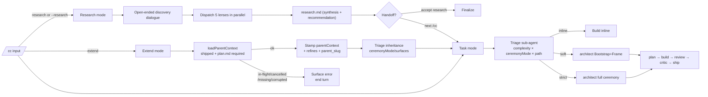

# cclaw

**A multi-stage planning + review harness for coding agents.**

cclaw drops a `/cc` slash command into Claude Code, Cursor, OpenCode, or Codex. It routes the task, picks the right amount of ceremony, and runs the work through a fixed pipeline: triage → plan → build → qa → review → critic → ship. Each stage emits a slim summary back to the harness and writes a tracked artifact under `.cclaw/flows/<slug>/`. Sub-agents are isolated; the orchestrator keeps the slug's history.

cclaw installs `/cc` and `/cc-cancel` into each harness. Inside `/cc`, three entry modes cover task work, research, and continuation flows.

## Why cclaw

- **One pipeline, depth scales.** Every task runs `triage → architect → builder → reviewer → critic → ship`. Plan-stage depth scales with `ceremonyMode` (lite for soft, rich for strict) instead of branching to a different specialist stack.
- **Always-auto, hard stops on failure.** The flow runs end-to-end without approval pickers at plan / review / critic gates. Hard failures stop and report with a plain-prose status block; resume with `/cc`, discard with `/cc-cancel`.
- **Two-model review.** A read-only reviewer walks ten axes; an adversarial critic falsifies what the reviewer cleared. They share no context and write to separate artifacts (`review.md`, `critic.md`).
- **Right-sized ceremony.** Trivial edits run inline (one commit, no plan). Small/medium tasks get a soft-mode plan + a single TDD cycle. Large-risky tasks get a per-slice build with a pre-implementation plan-critic gate.
- **Parallel by default.** Independent slices in a plan run in parallel — N independent slices finish in the time of the longest, not the sum.
- **Research as a separate entry point.** `/cc research <topic>` runs an open-ended discovery dialogue and dispatches research lenses in parallel (engineer / product / architecture / history / skeptic). Depth tiers (`--light` / `--standard` / `--deep-product`) gate the lens set; lenses dispatch first-class web search via MCP (`user-exa`, `user-context7`); synthesis runs a four-scan self-review before `research.md` lands. Optional handoff into a follow-up `/cc <task>` that consumes it as context.
- **Continuation flow.** `/cc extend <slug> <task>` loads a previously-shipped slug's `plan.md` / `build.md` / `learnings.md` (and `review.md` / `critic.md` / `qa.md` when present) as load-bearing context.
- **Same runtime, four harnesses.** Claude Code, Cursor, OpenCode, and Codex all read the same `.cclaw/` install. Each harness gets the same `/cc` body plus harness-namespaced ambient rules.
- **Compound learnings.** Non-trivial slugs emit a `learnings.md`. Future runs read prior shipped lessons through `knowledge.jsonl` before authoring a plan; outcome signals (`good` / `unknown` / `manual-fix` / `follow-up-bug` / `reverted`) down-weight priors that didn't hold up.

## When to use which command

| Intent | Command | What it does |
| --- | --- | --- |
| Execute a task end-to-end (code change) | `/cc <task>` | Full flow: triage → plan → build → review → critic → ship |
| Think / brainstorm / research a topic without committing to a task | `/cc research <topic>` | Open-ended discovery dialogue + 5 parallel research lenses + synthesised `research.md`; optional handoff to `/cc <task>` |
| Extend a previously-shipped slug with related work | `/cc extend <slug> <task>` | New flow with parent's plan/build/learnings loaded as context |
| Cancel the active flow | `/cc-cancel` | Discards current `.cclaw/flows/<slug>/`, frees the orchestrator |

## Quickstart

```bash
cd /path/to/your/repo
npx cclaw-cli@latest

# Inside your harness:
/cc add caching to the search endpoint
ls .cclaw/flows/20260515-search-caching/
# plan.md  build.md  review.md  critic.md  ship.md
```

The flow runs end-to-end. cclaw stops only on a hard failure (build broken, reviewer can't converge in 3 fixes, critic block-ship, catastrophic git/dispatch failure). Resume with `/cc`; discard with `/cc-cancel`. See [Failure handling](#failure-handling) below.

For CI / scripted installs, use the non-interactive escape hatch:

```bash
npx cclaw-cli@latest --non-interactive install --harness=cursor
```

There is no `cclaw plan`, `cclaw build`, or `cclaw status`. Flow control lives inside `/cc`.

### `/cc` invocation matrix

| Invocation | Active flow? | Behaviour |
| --- | --- | --- |
| `/cc` (no args) | yes | Continue the active flow silently. No "resume?" picker. |
| `/cc` (no args) | no | Error: "No active flow. Start with `/cc <task>`, `/cc research <topic>`, or `/cc extend <slug> <task>`." |
| `/cc <task>` | yes | Error: "Active flow: `<slug>` (stage: `<stage>`). Continue with `/cc`. Cancel with `/cc-cancel`." cclaw does NOT auto-cancel or queue. |
| `/cc <task>` | no | Start a new flow (dispatch triage). |
| `/cc research <topic>` | yes / no | Same pattern — error when active, start when not. |
| `/cc extend <slug> <task>` | yes / no | Same pattern — error when active, start when not. |
| `/cc-cancel` | yes | Cancel active flow (move artifacts to `flows/cancelled/<slug>/`, reset state). |
| `/cc-cancel` | no | Error: "No active flow to cancel." |

## Modes

Three top-level entry points share the `/cc` slash-command surface. The orchestrator picks the mode from the first token after `/cc`.

### `/cc <task>` — task mode

Runs the full triage → plan → build → review → critic → ship pipeline. The `triage` sub-agent picks `complexity × ceremonyMode × path` from heuristics, announces the choice in one line, and dispatches the first specialist. No clarifying questions; no structured ask.

Pin a ceremony level explicitly with mutually-exclusive flags:

```bash
/cc --inline <task>    # forces inline edit (one commit, no plan)
/cc --soft <task>      # forces soft-mode plan → build → review → ship
/cc --strict <task>    # forces strict + architect's full Frame → Compose pass + per-slice commits + plan-critic gate
```

When the project has no `.git/`, the router auto-downgrades strict → soft even with `--strict` (per-slice commits need a SHA chain to be useful).

Classification work — surface detection, assumption capture, prior-learnings lookup, interpretation forks — lives inside the `architect`'s Bootstrap + Frame phases on strict + soft, nothing on inline.

### `/cc research <topic>` — research mode

A separate entry point for pre-task uncertainty: brainstorming, scope exploration, architecture comparison. Runs as a main-context orchestrator in four phases. Output: `.cclaw/flows/<slug>/research.md`. No build / review / critic / ship.

```bash
/cc research storage strategy for shared agent memory
/cc --research auth library trade-offs                          # equivalent
/cc research --light is fastify still maintained                # 2 lenses, fast clarification
/cc research --deep-product should we replace our calendar      # 5 lenses + extra probes
```

**Depth tiers (v8.69).** The orchestrator picks one of three tiers at the Detect-hop research-mode fork — either explicitly via `--light` / `--standard` / `--deep-product` or auto-classified from topic wording (clarification → `light`; technical exploration → `standard`; greenfield / pivot wording → `deep-product`). Mutually-exclusive flags collapse last-wins.

| Depth | Lenses | Extra probes | When to use |
| --- | --- | --- | --- |
| `--light` | `research-engineer` + `research-skeptic` (2) | none | Clarification — "is X still maintained?", "which library does Y?", "what does the team currently use?" |
| `--standard` (default) | all 5 lenses | none | Technical exploration — "evaluate Redis vs in-memory cache", "should we move auth to JWT?" |
| `--deep-product` | all 5 lenses | `Thesis` + `Adjacent product` (product), `Durability` (skeptic), **Founder mode** — premise challenge (right problem? actual outcome? what if we did nothing? inversion) + strategic consequences (trajectory / identity / adoption / opportunity cost / compounding) + 10-star reframing (product) | Greenfield / pivot — "should we build...", "what if we replace...", "evaluate switching from..." |

**Phase 1 — open-ended discovery dialogue.** The orchestrator opens with `"Hi. What are you researching? Tell me what you know and what you don't."` and runs an **uncapped** dialogue (no fixed question budget; no auto-advance). You refine the topic, name constraints, surface prior attempts, name stakeholders, mark scope edges. The orchestrator proceeds only when you signal `ready` / `go ahead` / `finalize`.

**Phase 2 — parallel lens dispatch.** The orchestrator distils the dialogue into a 5-15 bullet summary and dispatches the depth-determined lens subset in parallel:

| Lens | What it covers |
| --- | --- |
| `research-engineer` | Technical feasibility, stack fit, blockers, implementation paths, risks, effort estimate |
| `research-product` | User / product value, who benefits, alternatives (always including "do nothing"), market context. **Deep-product** depth folds in `Thesis` + `Adjacent product` probes plus **Founder mode** — premise challenge + strategic consequences + 10-star reframing |
| `research-architecture` | System fit, surface impact, coupling, boundaries, scalability, in-repo precedents |
| `research-history` | Prior attempts via `.cclaw/knowledge.jsonl` + git log; lessons; outcome signals |
| `research-skeptic` | Failure modes, edge cases, abuse cases, hidden costs, don't-proceed triggers. **Deep-product** depth folds in `Durability` probe |

Engineer + architecture lenses may dispatch the `repo-research` helper for brownfield context. Engineer / product / architecture / skeptic lenses dispatch **first-class web search via MCP** (v8.69) — `user-exa` for general web search, `user-context7` for library / framework / API docs — and cite hits inline in their `### Sources` block. When no MCP tool is wired, lenses fall back to training knowledge with a `Notes:` tag stamping the fallback. History lens is memory-only (web search is out of scope). **Lenses run independently** — no lens cites or chains into another.

**Phase 3 — synthesis + self-review.** The orchestrator pastes each lens's findings verbatim into the matching `## <Lens> lens` section of `research.md`, then runs a cross-lens synthesis covering convergence (where 2+ lenses agree), divergence, the trade-off space, and confidence + coverage gaps. **Before `research.md` is written to disk**, the orchestrator walks the draft through a four-scan self-review (placeholder / contradiction / scope drift / ambiguity) and fixes findings inline; cleanups land in `## Synthesis > ### Self-review notes`. It then writes a recommended next step: exactly one of `plan with /cc <task>`, `more research needed (specific area)`, or `don't proceed (skeptic blocked: <reason>)`.

**Phase 4 — finalize.** `git mv` the artifact into `.cclaw/flows/shipped/<slug>/research.md` and emit a plain-prose handoff. The next `/cc <task>` invocation on the same project reads `flow-state.json > priorResearch` and consumes the most-recent shipped research as input to its plan stage. The handoff is optional — if research finalises and you never run a follow-up `/cc`, nothing else fires.

Research mode skips the router entirely — no triage gate, no `complexity` / `ceremonyMode` heuristic. The five lenses live in `src/content/research-lenses/`, install to `.cclaw/lib/research-lenses/<lens>.md`, and are NOT in the core `SPECIALISTS` array.

### `/cc extend <slug> <task>` — continuation mode

Initialises a new flow that explicitly extends a previously-shipped slug. The orchestrator loads the parent's `plan.md`, `build.md`, `learnings.md`, and (when present) `review.md` / `critic.md` / `qa.md` as `flowState.parentContext` and surfaces them to `architect` / `reviewer` / `critic` as load-bearing context. Things already settled by the parent are not re-decided.

```bash
/cc extend 20260514-auth-flow add SAML login                   # canonical
/cc extend 20260514-auth-flow --strict refactor session store  # ceremony override wins over inheritance
/cc extend 20260514-cli-help fix typo in --help                # inheritance
```

The orchestrator runs the same pipeline as `/cc <task>`; the only difference is at init:

- **Parent validation.** `loadParentContext` confirms the slug is shipped + has a non-empty `plan.md`. Four failure modes are explicit: `in-flight`, `cancelled`, `corrupted`, `missing`. Each surfaces a one-line error and ends the turn.
- **State stamp.** `flow-state.json > parentContext` carries the parent's slug + status + shippedAt + structured artifact paths. Plan.md frontmatter carries `parent_slug: <parent>` and `refines: <parent>`.
- **Triage inheritance.** `ceremonyMode` / `surfaces` default to the parent's values. Explicit `--strict` / `--soft` / `--inline` flags override. A security-keyword heuristic (`security` / `auth` / `migration` / `schema` / `payment` / `gdpr` / `pci`) auto-escalates a soft/inline parent → strict for the new flow.
- **Specialist consumption.** The architect's Bootstrap reads the parent's `## Spec` / `## Decisions` / `## Selected Direction` and authors a mandatory `## Extends` section at the top of `plan.md`. The reviewer runs a parent-contradictions cross-check (silent reversals of a parent decision are `required` findings). The critic adds a skeptic question on parent decision contradictions.
- **Knowledge-store integration.** When `parentContext` is set, `findNearKnowledge` prepends the parent's `knowledge.jsonl` entry to the top of the prior-learnings result (load-bearing context overrides Jaccard ranking).

Only the **immediate** parent is auto-loaded. Specialists may use `findRefiningChain` on demand when transitive context is needed.


```mermaid
flowchart LR
    A[/cc input/] -->|"research <topic>" or --research| R[Research mode]
    A -->|"extend <slug> <task>"| E[Extend mode]
    A -->|"<task>"| T[Task mode]

    R --> RD[Open-ended discovery dialogue]
    RD --> RL[Dispatch 5 lenses in parallel]
    RL --> RM["research.md (synthesis + recommendation)"]
    RM --> H{Handoff?}
    H -->|"accept research"| END[Finalize]
    H -->|next /cc| T

    E --> LC[loadParentContext<br/>shipped + plan.md required]
    LC -->|ok| EI[Stamp parentContext<br/>+ refines + parent_slug]
    EI --> EHE[Triage inheritance<br/>ceremonyMode/surfaces]
    EHE --> T
    LC -->|in-flight/cancelled<br/>/missing/corrupted| EERR[Surface error<br/>end turn]

    T --> RT[Triage sub-agent<br/>complexity × ceremonyMode × path]
    RT -->|inline| INL[Build inline]
    RT -->|soft| PL[architect Bootstrap+Frame]
    RT -->|strict| DS[architect full ceremony]
    PL --> BD[plan → build → review → critic → ship]
    DS --> BD
```

## Worked example

You type:

```text
/cc add caching to the search endpoint
```

The orchestrator runs through these stages, chaining automatically. Slim-summary blocks land under `## Triage`, `## Plan`, `## Build`, `## QA`, `## Review`, `## Critic`, `## Ship` headers in chat. Artifacts land on disk.

- **Triage.** The orchestrator dispatches `triage` with the raw `/cc` argument. Triage returns a 5-field decision in one slim summary — complexity: small-medium · ceremony mode: soft · path: plan → build → review → critic → ship · runMode: auto · mode: task — plus an `ambiguity_score: <0-100>` line computed from four signals (vague verbs, missing AC, multiple interpretations, no concrete names). Slug: `20260515-search-caching`. Zero clarifying asks at the triage Hop itself. Persisted to `flow-state.json > triage`; immutable for the slug.
- **Plan.** The `architect` opens a **Clarify phase** (v8.67) when `triage.ambiguityScore` crosses `config.clarify.ambiguity_threshold` (default 60) AND `ceremonyMode != "inline"` — one question per turn, max 5, early-exit on `go` / `ready` / `proceed`. Below threshold or on inline path: skipped silently. Either way, the architect writes `plan.md` opening with a mandatory `## Assumptions (correct me now)` block — Clarify answers are bare bullets, architect-silent inferences carry the `(architect inference)` tag. After plan.md lands, the orchestrator emits a one-line ack-window prose pointing the user at that section by name (`/cc` to continue with assumptions as-is, `/cc-cancel` to discard, or edit the plan in place). The rest of the plan body — Spec, Frame, **Plan / Slices** (SL-N work units — how we build), **Acceptance Criteria** (AC-N verification rows back-referencing slices), Edge cases, Topology, Feasibility, Traceability — is unchanged from pre-v8.67. 4 slices, 3 AC, 2 prior lessons surfaced via `learnings-research`. Confidence: high.
- **Build.** `builder` runs one TDD cycle per slice: RED → GREEN → REFACTOR. Each work commit carries an `SL-N` prefix (`red(SL-1):` / `green(SL-1):` / `refactor(SL-1):`) the reviewer reads via `git log --grep="(SL-N):"`. Slices are dispatched in topological layers with independent slices running in parallel by default; a task with N independent slices finishes in the time of the longest slice, not Σ. Single-slice layers run inline (zero overhead); plan-critic verifies independence claims against surface overlap so parallel sub-builders never race. On strict mode the builder runs a **two-stage per-slice review** (spec-compliance first, then code-quality) inside its own context after each slice — issues surface where the diff is one slice wide, not where the chain has compounded. Two-attempt cap per stage; on persistent failure the slice's status is `BLOCKED`. The builder emits a structured `Status:` (`DONE` / `DONE_WITH_CONCERNS` / `NEEDS_CONTEXT` / `BLOCKED`) the orchestrator routes deterministically — `DONE_WITH_CONCERNS` logs to `build.md > ## Concerns`; `NEEDS_CONTEXT` / `BLOCKED` stop and report. After all slices land, `builder` writes one `verify(AC-N): passing` commit per AC (empty diff when slice tests already cover the AC; test-files-only diff when the AC needs broader verification — perf budget, integration, contract). Tests: 14 passing (was 11). Coverage delta: +2.3%. Build failures trigger an auto-fix loop (up to 3 iterations); failure after 3 stops and reports.
- **Review.** Ten-axis reviewer opens 2 findings on the first iteration: cache-key collision on case-sensitive queries (`correctness`, `required`) and missing TTL refresh on stale entries (`architecture`, `consider`). Reviewer `critical` / `required-no-fix` triggers an auto-dispatch fix-only loop (up to 3 iterations); failure after 3 stops and reports. On `security_flag: true` slugs the reviewer walks the threat-model checklist verbatim in the `security` axis.
- **Critic.** Adversarial falsificationist pass — predictions, gap analysis, Criterion check across AC + Edge cases + NFR rows, goal-backward verification, realist check. Verdict: pass. `block-ship` stops immediately (no auto-iteration — re-running on unchanged code returns the same verdict).
- **Ship.** All 3 AC committed. `ship.md` carries the release-notes draft and the AC↔commit map. Chains automatically to push.

After ship, the orchestrator moves the artifacts to `.cclaw/flows/shipped/<slug>/` and (when the slug earned capture) appends one row to `.cclaw/state/knowledge.jsonl`.

## Failure handling

cclaw stops at hard failures per a fixed matrix. The recovery loop is always the same: read the status block, decide, type `/cc` (continue) or `/cc-cancel` (discard). No in-chat picker, no `[y/n]` ask, no "approve this?" gate.

| Failure | Behaviour |
| --- | --- |
| Build failure | Auto-fix loop, up to 3 iterations. After 3 unresolved → stop and report. |
| Reviewer `critical` / `required-no-fix` | Auto-dispatch fix-only loop, up to 3 iterations. After 3 unresolved → stop and report. |
| Critic `block-ship` | Stop immediately and report. No auto-iteration. |
| Catastrophic (git op fail, dispatch fail, missing tool) | Stop and report. |
| `Confidence: low` from any specialist | Stop and report. The specialist's `Notes:` line is surfaced verbatim. |

The status block names the stage, the reason, and the recovery options. Example:

```
Stopped at review (iteration 3). Reason: reviewer returned 2 critical findings after fix-only loop hit the 3-iteration cap.
To proceed: /cc to continue (continues from the saved state), or /cc-cancel to discard the slug.
```

## What you get

| Surface | Count + detail |
| --- | --- |
| **Specialists** | 7 sub-agents: `triage` (routing dispatch at Hop 2 of every fresh `/cc <task>`; emits a 5-field slim summary the orchestrator parses; detects design surface from ui/design/frontend/ux keywords for the reviewer's design-quality gate), `architect` (the only plan-stage specialist; runs as a single on-demand dispatch on every non-inline path, covers Bootstrap → Frame → Approaches → Decisions → Pre-mortem → Compose silently; absorbs classification work — assumption capture, surface detection, prior-learnings dispatch, interpretation forks; authors both `## Plan / Slices` and `## Acceptance Criteria` tables), `builder` (per-slice RED → GREEN → REFACTOR cycles on strict with `<type>(SL-N):` prefixes plus one `verify(AC-N): passing` commit per AC after slices land; single-cycle on soft), `plan-critic` (pre-implementation gate on strict + complexity≠trivial + AC≥2; checks slice-AC separation, slice quality, AC verifiability, coverage gaps), `qa-runner` (UI/web surfaces, ceremonyMode≠inline), `reviewer` (eleven-axis review with both slice + AC traceability chains on strict; walks the threat-model checklist verbatim in the `security` axis on `security_flag: true`; activates the gated `design-quality` axis on UI / design / frontend / ux surfaces — grades 7 design dimensions 0-10 with explicit "what a 10 looks like" references and runs the AI-slop check), `critic` (post-implementation adversarial pass with slice + AC coverage check). Each runs in isolation with a mandatory contract read. |
| **Research helpers** | `repo-research` (brownfield scan) and `learnings-research` (prior shipped lessons) dispatched in parallel before every plan. |
| **Research lenses** | 5 research-only sub-agents dispatched in parallel by the main-context research orchestrator on `/cc research <topic>` after the open-ended discovery dialogue completes: `research-engineer` (feasibility + paths + risks), `research-product` (user value + alternatives + market context), `research-architecture` (system fit + coupling + boundaries + scalability), `research-history` (prior attempts via `knowledge.jsonl` + git log; outcome signals), `research-skeptic` (failure modes + edge cases + abuse cases + hidden costs). NOT in `SPECIALISTS`; install to `.cclaw/lib/research-lenses/<lens>.md`. |
| **Ceremony modes** | `strict` (per-slice RED → GREEN → REFACTOR with `<type>(SL-N):` prefixes + per-AC `verify(AC-N): passing` commits — dual-chain reviewer cross-check), `soft` (single feature-level TDD cycle, plain commit), `inline` (one commit, no plan). Triage picks the mode. |
| **Plan template** | 15 sections strict (`Frame`, `Non-functional`, `Approaches`, `Selected Direction`, `Decisions`, `Pre-mortem`, `Not Doing`, `Plan`, `Spec`, `Plan / Slices`, `Acceptance Criteria (verification)`, `Feasibility stamp`, `Edge cases`, `Topology`, `Traceability block`); 6 sections soft (`Plan`, `Spec`, `Testable conditions`, `Verification`, `Touch surface`, `Notes`). Work-units (slices) are separate from verification (AC). |
| **Postures** | 6 per-criterion postures (`test-first`, `characterization-first`, `tests-as-deliverable`, `refactor-only`, `docs-only`, `bootstrap`). Each maps to a fixed commit-shape recipe the reviewer enforces ex-post. |
| **Review** | 10 reviewer axes — 8 base (`correctness`, `readability`, `architecture`, `security`, `perf`, `test-quality`, `complexity-budget`, `edit-discipline`) plus 2 gated (`qa-evidence` when qa-runner ran, `nfr-compliance` when `## Non-functional` is non-empty). Append-only findings table, convergence detector, severity-aware ship gate. |
| **Critic step** | Falsificationist pass after review clears: §1 predictions, §2 gap analysis, §3 four adversarial techniques + 6 human-perspective lenses (executor / stakeholder / skeptic for plan-stage, security / new-hire / ops for code-stage), §4 Criterion check (AC + Edge cases + NFR), §5 goal-backward, §6 realist check, §7 verdict, §8 summary. |
| **Auto-trigger skills** | 24 skills (`triage-gate`, `plan-authoring`, `tdd-and-verification`, `review-discipline`, `commit-hygiene`, `completion-discipline`, `pre-edit-investigation`, `qa-and-browser`, `debug-and-browser`, `ac-discipline`, `source-driven`, `summary-format`, `documentation-and-adrs`, `parallel-build`, `refinement`, `flow-resume`, `receiving-feedback`, `anti-slop`, `conversation-language`, `api-evolution`, `pre-flight-assumptions`, `slice-discipline`, `ambiguity-discipline`, `structured-status`). Auto-applied per stage. |
| **On-demand runbooks** | 13 runbooks loaded by trigger (`dispatch-envelope`, `parallel-build`, `finalize`, `cap-reached-recovery`, `adversarial-rerun`, `handoff-gates`, `handoff-artifacts`, `compound-refresh`, `pause-resume`, `critic-steps`, `qa-stage`, `extend-mode`, `always-auto-failure-handling`). Kept out of the orchestrator body to hold the prompt budget. |
| **Anti-rationalization catalog** | `.cclaw/lib/anti-rationalizations.md` carries the cross-cutting rebuttal table (posture-bypass, completion-discipline, edit-discipline, verification rows). Each specialist's prompt cites the catalog and adds specialist-specific rows. |
| **Outcome signals** | 5-value enum (`good`, `unknown`, `manual-fix`, `follow-up-bug`, `reverted`) recorded on `knowledge.jsonl` rows. Three capture paths (orchestrator scans on every `/cc` for follow-up-bug references; compound time scans for revert commits and same-touch-surface manual-fix commits). Prior-learnings lookup multiplies similarity by signal weight before threshold filtering. |
| **Discipline skills** | `completion-discipline` (no `✅ complete` without paired fresh evidence), `pre-edit-investigation` (three-probe gate before any edit), `receiving-feedback` (builder fix-only response protocol), `structured-status` (builder emits one of four canonical statuses — `DONE` / `DONE_WITH_CONCERNS` / `NEEDS_CONTEXT` / `BLOCKED` — orchestrator routes deterministically), plus `edit-discipline` as a reviewer axis. |
| **Harness-embedded rules** | Every supported harness installs cclaw's Iron Laws + anti-rationalizations + antipatterns into its own ambient surface (`.cursor/rules/`, `.claude/`, `.codex/`, `.opencode/`). cclaw never touches root `AGENTS.md`, `CLAUDE.md`, or `GEMINI.md`. |
| **Parallel build** | Independent slices run in parallel by default (up to 5 sub-builders on git worktrees). Triggered automatically when a layer has ≥2 slices with `independent: true` and disjoint touch-surface clusters; single-slice layers run inline. `ceremonyMode: strict` required. |
| **Multi-harness install** | Claude Code, Cursor, OpenCode, Codex — same `.cclaw/` runtime, different harness adapters. |

## Harnesses supported

| Harness | Detection | Status |
| --- | --- | --- |
| Claude Code | `CLAUDE.md` or `.claude/` | Supported |
| Cursor | `.cursor/` | Supported |
| OpenCode | `opencode.json[c]` or `.opencode/` | Supported |
| Codex | `.codex/` or `.agents/skills/` | Supported |

Run `npx cclaw-cli@latest` and the TUI auto-detects whatever you have. For CI / scripted installs, pass `--non-interactive install --harness=<id>[,<id>]` (comma-separated; supported ids: `claude`, `cursor`, `opencode`, `codex`).

## Configuration

`.cclaw/config.yaml` is optional. Defaults are good. Common knobs:

```yaml
harnesses: [claude, cursor]
reviewerTwoPass: false              # opt-in: spec-review + code-quality-review split
compoundRefreshEvery: 5             # how often to dedup knowledge.jsonl
compoundRefreshFloor: 10            # minimum entries before refresh kicks in
captureLearningsBypass: false       # true = silent skip on non-trivial slugs
legacy-artifacts: false             # true brings back legacy extra artifacts
architect:
  ambiguity_threshold: 0.2          # ambiguity soft-warning threshold
```

## Architecture deep dive

The runtime is under 1 KLOC. The prompt content is where the work lives. To understand how `/cc` actually works, read the source under `src/content/`:

- [`src/content/start-command.ts`](src/content/start-command.ts) — orchestrator body (detect, dispatch, always-auto chain, critic step, ship, compound, finalize).
- [`src/content/specialist-prompts/`](src/content/specialist-prompts/) — 7 specialist contracts.
- [`src/content/skills/`](src/content/skills/) — 21 auto-trigger skill bodies.
- [`src/content/runbooks-on-demand.ts`](src/content/runbooks-on-demand.ts) — 13 on-demand runbooks loaded by trigger.
- [`src/content/artifact-templates.ts`](src/content/artifact-templates.ts) — plan / build / qa / review / critic / plan-critic / ship / learnings templates.
- [`src/content/anti-rationalizations.ts`](src/content/anti-rationalizations.ts) — cross-cutting rebuttal catalog.
- [`CHANGELOG.md`](CHANGELOG.md) — release history.

## Artifact tree (after install)

```
.cclaw/
  config.yaml               flow defaults
  state/
    flow-state.json         active flow state (~500 bytes)
    knowledge.jsonl         compound learnings index
    triage-audit.jsonl      routing audit log
  flows/
    <slug>/                 one folder per active task
      plan.md
      build.md
      qa.md                 (UI/web slugs only)
      review.md
      critic.md
      plan-critic.md        (strict + complexity≠trivial + AC≥2)
      ship.md
      research.md           (/cc research <topic> only)
    shipped/<slug>/         finalized tasks (including research-mode flows)
    cancelled/<slug>/       /cc-cancel destination
  lib/
    agents/                 7 specialist contracts + 2 read-only research helpers (learnings-research / repo-research)
    research-lenses/        5 research-only lens contracts
    skills/                 21 auto-trigger skill bodies
    templates/              artifact templates
    runbooks/               13 on-demand runbooks
    patterns/               reference patterns
    anti-rationalizations.md
    antipatterns.md
```

## CLI surface

Two invocations cover every use case. There is no `cclaw plan` / `cclaw status` / `cclaw build` / `cclaw ship` — flow control lives inside `/cc`.

```bash
# Interactive (humans): opens a TUI menu — Install / Uninstall / Quit
npx cclaw-cli@latest

# Non-interactive (CI / scripts): explicit command, no TUI
npx cclaw-cli@latest --non-interactive install [--harness=<id>[,<id>]]
npx cclaw-cli@latest --non-interactive uninstall
npx cclaw-cli@latest --non-interactive knowledge [--tag=<tag>] [--surface=<sub>] [--type=<kind>] [--all] [--json]
npx cclaw-cli@latest --version
npx cclaw-cli@latest --help
```

`install` is idempotent and runs orphan cleanup, so it handles first-time setup, re-sync after a package upgrade, and stale-file cleanup in one command. The TUI menu and the `--non-interactive install` path share the same installer code — they are byte-for-byte identical in write behaviour.

## Contributing

cclaw is dogfooded — every release is shipped via `/cc` against itself. To contribute:

1. Fork and clone.
2. `npm install && npm run build && npm test` (the test suite is the spec; PRs without test updates are rare).
3. Run `/cc <your change>` inside a cclaw-installed harness, or write tests + code directly.
4. Open a PR. CI runs lint, typecheck, unit tests, integration tests, and a smoke runtime test.

The runtime stays under 1 KLOC; new behaviour usually means new prompt content under `src/content/`, not new code under `src/`.

## License

MIT. See [LICENSE](LICENSE).
