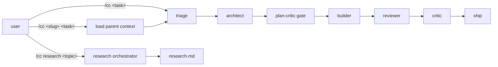

# cclaw

**A multi-stage planning + review harness for coding agents.**

Drops `/cc` into Claude Code, Cursor, OpenCode, and Codex. Every task flows through `triage → plan → build → review → critic → ship`. Two reviewers run in series — a read-only walk over 9 axes, then an adversarial critic that falsifies what the reviewer cleared. Independent slices run in parallel worktrees. Sub-agents stay isolated; the orchestrator keeps the slug's history. Always-auto: no "approve this?" pickers between stages. Resume with `/cc`, discard with `/cc-cancel`.

## Install

```bash
cd /path/to/your/repo
npx cclaw-cli@latest
```

The TUI auto-detects your harness. For CI / scripted installs:

```bash
npx cclaw-cli@latest --non-interactive install --harness=cursor
```

Supported harnesses: `claude` (`CLAUDE.md` or `.claude/`), `cursor` (`.cursor/`), `opencode` (`opencode.json[c]` or `.opencode/`), `codex` (`.codex/` or `.agents/skills/`). Same `.cclaw/` runtime, harness-namespaced ambient rules — install once per harness if you use more than one.

## Use

Three entry shapes share the `/cc` surface:

```bash
# 1. Ship a code change end-to-end.
# Triage → plan → build → review → critic → ship, chained automatically.
/cc add caching to the search endpoint

# 2. Open-ended research, no build.
# Dispatches up to 6 research lenses in parallel; synthesises research.md.
/cc research storage strategy for shared agent memory

# 3. Refine a shipped slug — the first token IS the slug.
# Triage picks the ceremony: a tiny tweak lands as a single-commit patch
# (patch-N.md next to the parent, no new slug); anything larger runs the
# full follow-up arc with the parent's plan / build / learnings as context.
/cc 20260514-auth-flow rename loginUser to authenticateUser
/cc 20260514-auth-flow add SAML login

# Cancel the active flow.
/cc-cancel
```

Slim summaries land in chat under `## Triage`, `## Plan`, `## Build`, `## Review`, `## Critic`, `## Ship`; artifacts land on disk under `.cclaw/flows/<slug>/`. cclaw stops only on hard failures (build broken, reviewer can't converge in 3 fixes, critic block-ship, irreversible decision pending user confirmation). The status block names the stage and the reason — type `/cc` to continue or `/cc-cancel` to discard.

## How it works

`triage` picks the ceremony tier from the task shape and dispatches the first specialist. Each specialist runs in isolation, writes one artifact, returns one slim summary; the orchestrator forwards the slug's history but nothing else. After build, two reviewers run in series — a read-only `reviewer` walks 14 quality axes, then an adversarial `critic` falsifies what the reviewer cleared (separate contexts, separate artifacts). On UI / SDK surfaces, `plan-critic` gates the plan against a design or DevEx rubric *before* build burns context. Bug reports route through an `investigator` ahead of `architect`. Shipped slugs emit `learnings.md`; future plans read prior lessons through `knowledge.jsonl` before authoring.


```mermaid
flowchart LR
 U[user] -->|"/cc &lt;task&gt;"| T[triage]
 U -->|"/cc research &lt;topic&gt;"| RES[research orchestrator]
 U -->|"/cc &lt;slug&gt; &lt;task&gt;"| PT[load parent context]
 PT --> T
 T --> AR[architect]
 AR --> PC[plan-critic gate]
 PC --> B[builder]
 B --> RV[reviewer]
 RV --> C[critic]
 C --> S[ship]
 RES --> RM[research.md]
```

## Ceremony modes

| Mode | When triage picks it | Pipeline |
|------|---------------------|----------|
| `inline` | trivial edits — typo, comment, one-line fix; also auto-set when triage downgrades a refine (`/cc <slug> <task>`) to a post-ship patch | one commit, no plan |
| `soft` (default) | small / medium tasks | architect → single TDD cycle → reviewer → critic → ship |
| `strict` | risky / multi-slice / security / migration | architect → plan-critic gate → per-slice TDD → reviewer (dual-chain) → critic → ship |

Triage announces its auto-pick in one line before the first specialist runs, so you can see what was chosen and reframe the task on the next invocation if the tier is wrong. The triage heuristic is the source of truth for the tier; v8.112 retired the per-flow ceremony override flags in favour of trusting the router. Pin via the task wording itself ("just a typo", "small refactor", "auth migration") — the heuristic reads those signals deterministically.

## Configuration

`.cclaw/config.yaml` is optional. Defaults are good — every knob below is opt-in.

| Knob | Default | Purpose |
| --- | --- | --- |
| `harnesses` | _(set at install time; merged on re-install)_ | List of harnesses to wire (`claude` / `cursor` / `opencode` / `codex`). v8.109 — re-running `install --harness=<id>` MERGES with the existing list instead of replacing it. |
| `legacyArtifacts` | `false` | Keep the pre-v8.11 9-artefact layout (separate `manifest.md` / `pre-mortem.md` / `decisions.md`) instead of the consolidated `plan.md` shape. |
| `compoundRefreshEvery` | `5` | Run the compound-refresh sub-step every Nth capture (T2-4 everyinc). Set to `0` to disable. |
| `compoundRefreshFloor` | `10` | Minimum `knowledge.jsonl` entries the floor gate requires before compound-refresh fires. Belt-and-braces with `compoundRefreshEvery`. |
| `captureLearningsBypass` | `false` | Skip the learnings hard-stop structured-ask in CI / autonomous pipelines that can't surface an interruption. |
| `modelPreferences.<specialist>` | per-specialist | Tier hint (`fast` / `balanced` / `powerful`) passed through to the harness's model router on dispatch. |
| `clarify.ambiguity_threshold` | `60` | `triage.ambiguityScore >= this` AND `ceremonyMode != "inline"` opens the architect's Clarify phase before Bootstrap. Integer in `[0, 100]`. |

Example:

```yaml
harnesses: [claude, cursor]
clarify:
  ambiguity_threshold: 60 # default; lower = more Clarify, higher = less
modelPreferences:
  builder: balanced # default fast
  reviewer: powerful # default balanced
  critic: balanced # default powerful
compoundRefreshEvery: 5
compoundRefreshFloor: 10
captureLearningsBypass: false
```

## Deeper docs

The runtime is < 1 KLOC; behaviour lives in prompt content under `src/content/`. To understand how `/cc` actually works, read the source:

- [`src/content/start-command.ts`](src/content/start-command.ts) — orchestrator body (detect, dispatch, ship, compound)
- [`src/content/specialist-prompts/`](src/content/specialist-prompts/) — 8 specialist contracts (`triage`, `investigator`, `architect`, `builder`, `plan-critic`, `qa-runner`, `reviewer`, `critic`)
- [`src/content/skills/`](src/content/skills/) — 32 auto-trigger skills loaded per stage
- [`src/content/research-lenses/`](src/content/research-lenses/) — 6 research lenses dispatched on `/cc research`
- [`src/content/runbooks-on-demand.ts`](src/content/runbooks-on-demand.ts) — 26 on-demand runbooks loaded by trigger
- [`src/content/artifact-templates.ts`](src/content/artifact-templates.ts) — plan / build / qa / review / critic / ship templates
- [`src/content/anti-rationalizations.ts`](src/content/anti-rationalizations.ts) — cross-cutting rebuttal catalog
- [`CHANGELOG.md`](CHANGELOG.md) — release history with every flag, gate, rubric, and version
- [`CONTRIBUTING.md`](CONTRIBUTING.md) — dogfooded; new behaviour usually means new prompt content under `src/content/`, not new TypeScript

## License

MIT. See [LICENSE](LICENSE).
