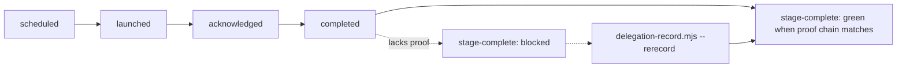
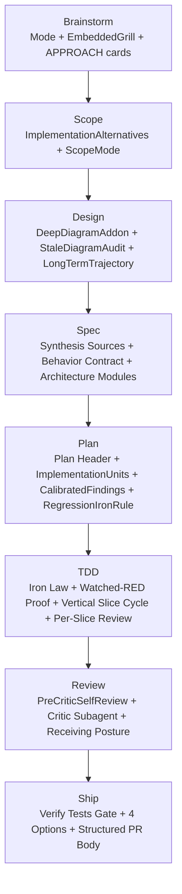

# cclaw Quality Gates — Per-Stage Reference

This document maps each cclaw stage to the **structural sections** the linter
enforces and the upstream **reference patterns** they were derived from. Every
section listed here is a *shape* check, not a content check: the linter never
inspects domain words ("CRUD", "endpoint", "form", etc.), only that the canonical
section is present and well-formed. For early stages (`brainstorm`, `scope`, `design`), many ceremony-heavy shape checks are advisory only; convergence, approval, boundary/risk mapping, and handoff continuity remain the hard blockers.

The reference paths refer to skill packages outside this repo. They are listed
for traceability only — cclaw does not vendor them.

## Layer 1 — Runtime Delegation Proof (universal)

| cclaw artifact | Section / proof | Source pattern | Source reference |
|---|---|---|---|
| `.cclaw/hooks/delegation-record.mjs` | Strict `--dispatch-surface` enum (`opencode-agent` / `claude-task` / `cursor-task` / `codex-agent` / `role-switch` / `generic-task`) | OpenCode/Codex/Cursor/Claude native dispatch surfaces | `src/harness-adapters.ts::harnessDispatchSurface` |
| `.cclaw/hooks/delegation-record.mjs` | `--agent-definition-path` validated against allowed prefixes per surface | per-harness directory layout | `src/delegation.ts::DELEGATION_DISPATCH_SURFACE_PATH_PREFIXES` |
| `.cclaw/state/delegation-log.json` | Schema v3 with `legacy-inferred` fulfillment mode | `src/delegation.ts::DELEGATION_LEDGER_SCHEMA_VERSION` | (this repo) |
| `.cclaw/hooks/delegation-record.mjs` | `--rerecord` subcommand to upgrade pre-v3 entries | `src/content/hooks.ts::runRerecord` | (this repo) |
| `stage-complete` diagnostics | Distinct reasons: `missing` / `missingDispatchProof` / `legacyInferredCompletions` / `corruptEventLines` / `staleWorkers` / `missingEvidence` | `src/internal/advance-stage.ts::buildValidationReport` | (this repo) |

A complete dispatch lifecycle is `scheduled` → `launched` → `acknowledged` → `completed`,
recorded with the same `<span-id>` and `<dispatch-id>` on each call. Completed
isolated/generic rows fail unless the same span has an `acknowledged` event or
the completion call includes `--ack-ts=<iso>`.

## Layer 2 — Per-Stage Structural Gates

### Brainstorm (`01-brainstorm.md`)

| Section | What the linter checks | Source pattern | Source reference |
|---|---|---|---|
| `## Mode Block` | Exactly one of `STARTUP / BUILDER / ENGINEERING / OPS / RESEARCH` | gstack `office-hours` Phase 1 | `gstack/office-hours/SKILL.md` |
| `## Embedded Grill` | Recommended post-pick stress-check rows (question + recommended answer + disposition) for constraints/reversibility/boundaries/pattern-fit/domain-language | evanflow Embedded Grill | `evanklem-evanflow/skills/evanflow-brainstorming/SKILL.md` |
| Approach Detail Cards (`#### APPROACH <letter>`) | ≥2 blocks with Summary/Effort/Risk/Pros/Cons/Reuses | superpowers + gstack Phase 4 | `obra-superpowers/skills/brainstorming/SKILL.md`, `gstack/office-hours/SKILL.md` |
| `RECOMMENDATION:` | Exactly one rationale line traced to forcing-questions/premises | superpowers + gstack Phase 4 | as above |
| `## Outside Voice` | When present: `source:` / `prompt:` / `tension:` / `resolution:` (or explicit `not used`) | gstack Phase 3.5 | `gstack/office-hours/SKILL.md` |

### Scope (`02-scope.md`)

| Section | What the linter checks | Source pattern | Source reference |
|---|---|---|---|
| `## Implementation Alternatives` | `RECOMMENDATION:` line referencing chosen option | gstack `plan-ceo-review` Step 0C-bis | `gstack/plan-ceo-review/SKILL.md` |
| `## Scope Mode` (existing) | One of `SCOPE_EXPANSION / SELECTIVE_EXPANSION / HOLD_SCOPE / SCOPE_REDUCTION` | gstack Step 0F | `gstack/plan-ceo-review/SKILL.md` |
| Expansion strategist delegation | If Scope Summary mode is `SCOPE EXPANSION` or `SELECTIVE EXPANSION`, active-run delegation log must include completed `product-strategist` row with non-empty `evidenceRefs` | gstack expansion vision + opt-in ceremony | `gstack/plan-ceo-review/SKILL.md` |

### Design (`03-design.md`)

| Section | What the linter checks | Source pattern | Source reference |
|---|---|---|---|
| `## Deep Diagram Add-on` | Deep tier requires one marker in the section: `<!-- diagram: state-machine -->` OR `<!-- diagram: rollback-flowchart -->` OR `<!-- diagram: deployment-sequence -->` | gstack deep design review add-ons | `gstack/plan-eng-review/SKILL.md` |
| `design_diagram_freshness` gate (`Stale Diagram Drift Check`) | Default-on stale-diagram drift check; can be explicitly disabled via `optInAudits.staleDiagramAudit: false`; compact trivial-override slices without diagram markers get explicit skip status | gstack stale diagram audit discipline | `gstack/plan-eng-review/SKILL.md` |
| `## Long-Term Trajectory` | Recommended 1-3 line section stating post-ship phase path and architecture fit for that trajectory | gstack Section 10 Long-Term Trajectory Review | `gstack/plan-ceo-review/SKILL.md` |

### Spec (`04-spec.md`)

| Section | What the linter checks | Source pattern | Source reference |
|---|---|---|---|
| `## Synthesis Sources` | ≥1 populated source row (synthesize, don't interview) | evanflow PRD Step 1 | `evanklem-evanflow/skills/evanflow-prd/SKILL.md` |
| `## Behavior Contract` | ≥3 behaviors in `As a/I can/so that` or `Given/When/Then` form, or `- None.` | evanflow PRD + universal behavior frame | `evanklem-evanflow/skills/evanflow-prd/SKILL.md` |
| `## Architecture Modules` | No code fences, no function/class signatures (modules listed by responsibility only) | evanflow "no code in spec" rule | `evanklem-evanflow/skills/evanflow-prd/SKILL.md` |
| Single-subsystem scope heuristic | Recommended warning when `Architecture Modules` lists >5 named modules (split into sub-specs / narrow scope before plan handoff) | superpowers spec-review focus (`single plan`) | `obra-superpowers/skills/brainstorming/spec-document-reviewer-prompt.md` |
| `## Spec Self-Review` | All four checks present: placeholder / consistency / scope / ambiguity | superpowers Spec Self-Review | `obra-superpowers/skills/brainstorming/SKILL.md` |

### Plan (`05-plan.md`)

| Section | What the linter checks | Source pattern | Source reference |
|---|---|---|---|
| `## Plan Header` | `Goal:` / `Architecture:` / `Tech Stack:` lines present | superpowers `writing-plans` header | `obra-superpowers/skills/writing-plans/SKILL.md` |
| `### Implementation Unit U-<n>` | Each unit includes Goal / Files / Approach / Test scenarios / Verification | ce-plan §3.5 + superpowers tasks | `everyinc-compound/.../ce-plan/SKILL.md`, `obra-superpowers/skills/writing-plans/SKILL.md` |
| `## Calibrated Findings` | Recommended: `None this stage` or canonical lines `[P1\|P2\|P3] (confidence: <n>/10) <path>[:<line>] — <description>` | gstack calibrated findings discipline | `gstack/plan-eng-review/SKILL.md` |
| `## Regression Iron Rule` | Recommended: `Iron rule acknowledged: yes` | gstack regression discipline | `gstack/plan-eng-review/SKILL.md` |
| Plan-wide placeholder scan | Forbidden tokens (`TBD`, `TODO`, `FIXME`, etc.) outside the rule section | superpowers NO PLACEHOLDERS | `obra-superpowers/skills/writing-plans/SKILL.md` |
| `## Execution Handoff` | Posture declared (Subagent-Driven or Inline executor) | superpowers Execution Handoff | `obra-superpowers/skills/writing-plans/SKILL.md` |

### TDD (`06-tdd.md`)

| Section | What the linter checks | Source pattern | Source reference |
|---|---|---|---|
| `## Iron Law Acknowledgement` | `Acknowledged: yes` line | superpowers Iron Law | `obra-superpowers/skills/test-driven-development/SKILL.md` |
| `## Watched-RED Proof` | At least one populated row; each populated row includes an ISO timestamp | superpowers "watch it fail" | `obra-superpowers/skills/test-driven-development/SKILL.md` |
| `## Vertical Slice Cycle` | Each row references RED, GREEN, REFACTOR | evanflow vertical slices | `evanklem-evanflow/skills/evanflow-tdd/SKILL.md` |
| `## TDD Blocker Taxonomy` | Recommended blocked-state classification uses canonical classes (`NO_SOURCE_CONTEXT`, `NO_TEST_SURFACE`, `NO_IMPLEMENTABLE_SLICE`, `RED_NOT_EXPRESSIBLE`, `NO_VCS_MODE`) with resume contract fields | cclaw TDD blocker taxonomy | `src/content/stages/tdd.ts` |
| `## Per-Slice Review` | Recommended when `sliceReview` triggers: Spec-Compliance + Quality passes with trigger and fulfillment mode | cclaw sliceReview contract | `src/content/stages/tdd.ts` |
| Mock preference heuristic | Recommended warning when mock/spy tokens appear without explicit trust-boundary justification (prefer Real > Fake > Stub > Mock) | addyosmani + superpowers testing anti-patterns | `addyosmani-skills/skills/test-driven-development/SKILL.md`, `obra-superpowers/skills/test-driven-development/testing-anti-patterns.md` |

### Review (`07-review.md`)

| Section | What the linter checks | Source pattern | Source reference |
|---|---|---|---|
| `## Pre-Critic Self-Review` | Self-check items plus Goal / Approach / Risk areas / Verification done / Open questions in one merged pre-critic frame | evanflow review frame + superpowers requesting/receiving | `evanklem-evanflow/skills/evanflow-review/SKILL.md`, `obra-superpowers/skills/requesting-code-review/SKILL.md` |
| `## Critic Subagent Dispatch` | Agent definition path / Dispatch surface / Frame sent / Critic returned all present | superpowers requesting-code-review | `obra-superpowers/skills/requesting-code-review/SKILL.md` |
| `## Receiving Posture` | `No performative agreement (forbidden openers acknowledged)` | superpowers receiving-code-review | `obra-superpowers/skills/receiving-code-review/SKILL.md` |

### Ship (`08-ship.md`)

| Section | What the linter checks | Source pattern | Source reference |
|---|---|---|---|
| `## Verify Tests Gate` | `Result: PASS` or `Result: FAIL` | superpowers finishing-a-development-branch Step 1 | `obra-superpowers/skills/finishing-a-development-branch/SKILL.md` |
| `## Finalization Options` | All four canonical tokens (`MERGE_LOCAL`, `OPEN_PR`, `KEEP_BRANCH`, `DISCARD`) | superpowers finishing Step 3 | `obra-superpowers/skills/finishing-a-development-branch/SKILL.md` |
| `## Structured PR Body` | `## Summary`, `## Test Plan`, `## Commits Included` subsections | ce-pr-description + superpowers PR body | `everyinc-compound/.../ce-pr-description/SKILL.md`, `obra-superpowers/skills/finishing-a-development-branch/SKILL.md` |

## Cross-Cutting Universal Mechanics

These are reusable blocks injected into every stage skill from
`src/content/skills.ts`. Linter rules listed above reference them where the
shape is checked structurally.

| Block | Builder | Where it appears |
|---|---|---|
| STOP-per-issue protocol | `stopPerIssueBlock()` | every stage skill, plus structural checks for approach/detail and implementation-alternatives recommendation paths |
| Confidence calibration | `confidenceCalibrationBlock()` | every stage skill; format used in design `Calibrated Findings` |
| Outside Voice slot | `outsideVoiceSlotBlock()` | every stage skill; structural shape checked when section present |
| Anti-sycophancy | `antiSycophancyBlock()` | every stage skill; guidance-level posture (no dedicated brainstorm section gate) |
| NO PLACEHOLDERS | `noPlaceholdersBlock()` + `FORBIDDEN_PLACEHOLDER_TOKENS` | every stage skill; plan stage runs full-artifact scan |
| Watched-fail proof | `watchedFailProofBlock()` | tdd, review, ship skills; tdd `Watched-RED Proof` is the strongest enforcement |

## Stage-by-Stage Flow

## Diverse Task Types — Same Gates

The structural sections above apply equally to:

- **CLI utility** — example scope: extracting a parser into a shared package.
- **Library / SDK** — example scope: adding a streaming API to an existing parser.
- **Infra / migration** — example scope: switching from rolling restart to blue/green cutover.

The linter never reads vocabulary specific to web/CRUD/UI work. Failure-modes
columns (`User sees?`, `Logged?`) are deliberately neutral so they map cleanly
to any runtime: a CLI prints to stderr, a library throws or returns an error
union, an infra job emits a structured failure event.

See `tests/unit/quality-gate-fixtures.test.ts` for executable evidence on each
of those task types.
