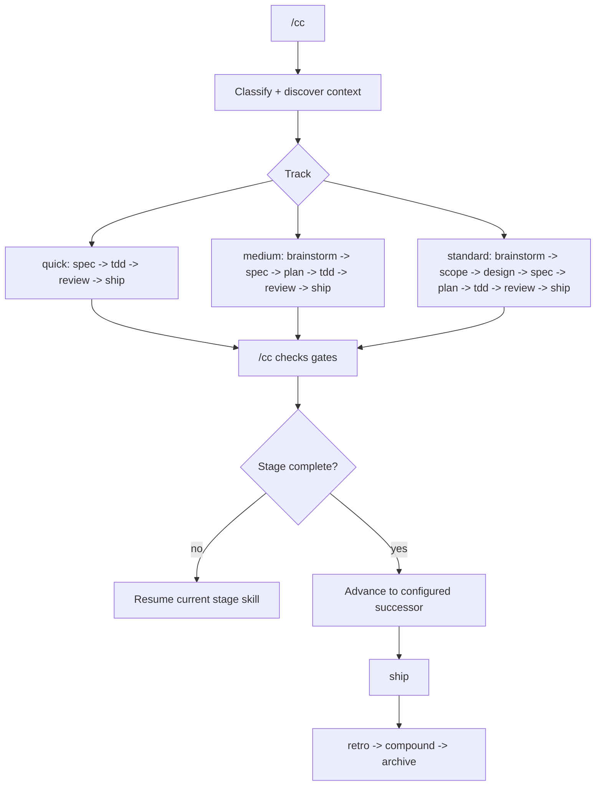
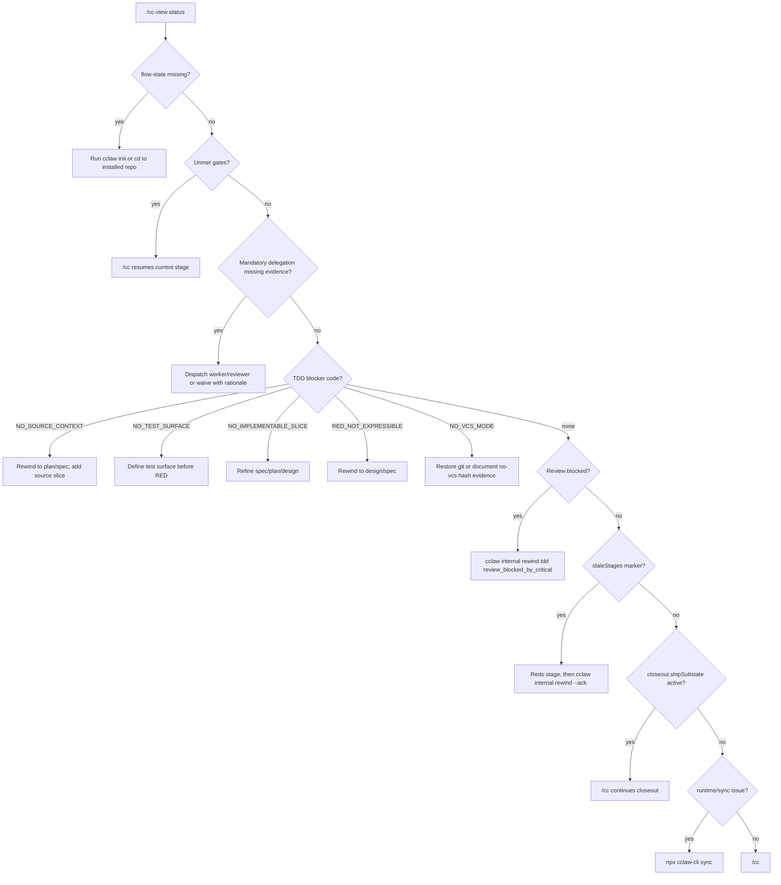
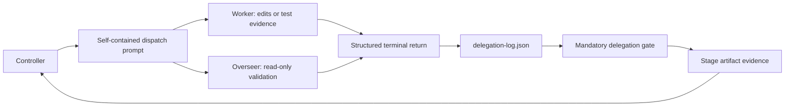

# Scheme Of Work

This is cclaw's canonical human-readable flow contract. Generated prompts and command files can be verbose because they serve agents; this document is the compact contract humans should read first.

## Contract Summary

cclaw is a file-backed flow runtime for coding agents. The controller starts from `/cc <idea>`, writes state and artifacts under `.cclaw/`, advances with `/cc`, exposes recovery through `/cc-view status`, and closes every shipped run through `retro -> compound -> archive`.

A run is healthy when the operator can see `Current`, `Blocked by`, `Next`, and `Evidence needed` in plain English.

## Entry And Resume

Use `/cc <idea>` to start a tracked software change. `/cc` without a prompt resumes only when a tracked flow already exists. `/cc` is the normal resume and progression command after the run starts.

Startup sequence:

1. Classify the prompt as software, bugfix/trivial, pure question, or non-software.
2. Discover origin docs and stack signals before asking for more context.
3. Recommend a track with a one-line confidence reason.
4. Ask only when reset, contradiction, ambiguity, or user override requires it.
5. Start or reclassify only through `node .cclaw/hooks/start-flow.mjs`.

## Stage Flow



Canonical critical-path stages are `brainstorm`, `scope`, `design`, `spec`, `plan`, `tdd`, `review`, and `ship`.

Tracks:

- `quick`: `spec -> tdd -> review -> ship`.
- `medium`: `brainstorm -> spec -> plan -> tdd -> review -> ship`.
- `standard`: `brainstorm -> scope -> design -> spec -> plan -> tdd -> review -> ship`.

Every stage has a generated skill, a stage artifact, required gates, artifact validation rules, and optional or mandatory subagent dispatch. `/cc` follows `flow-state.json.track` and `skippedStages`; it must not use the natural stage edge when the active track skips a stage.

## Closeout Flow

Ship is not the end of the run. When `ship` is complete, `/cc` continues the closeout chain using `closeout.shipSubstate` inside `.cclaw/state/flow-state.json`.

```text
idle -> retro_review -> compound_review -> ready_to_archive -> archived
```

- `retro_review`: draft or continue `09-retro.md`, then ask accept/edit/skip once.
- `compound_review`: scan `.cclaw/knowledge.jsonl` and readiness state for recurring learnings; promote, refresh, supersede, or skip.
- `ready_to_archive`: run archive, snapshot state/artifacts, and reset active flow.
- `archived`: report that the run is archived and stop.

Do not route normal closeout through a separate compound command. Continue with `/cc`.

## Gates And Blockers

Required gates are blocking for stage completion. Recommended checks may create concerns, but they do not advance the state by themselves.

Blocking surfaces:

- Required gate missing from `stageGateCatalog[currentStage].passed`.
- Required gate present in `blocked`.
- Mandatory delegation missing, failed, stale, or completed without required evidence refs.
- `staleStages[currentStage]` exists after rewind.
- Review has unresolved criticals and must route back to TDD.
- TDD cannot produce real RED/GREEN/REFACTOR evidence.
- Closeout substate is waiting on retro, compound, or archive.
- Generated hooks or harness shims are stale or broken.

The stage completion helper is the canonical mutation path:

```bash
node .cclaw/hooks/stage-complete.mjs <stage> --evidence-json '{"<gate_id>":"<evidence>"}' --passed=<gate_id>
```

Do not manually edit `.cclaw/state/flow-state.json` to force progress.

## Recovery Decision Tree



| Blocker | Meaning | Next action |
|---|---|---|
| Missing flow state | cclaw is not installed here or the agent is in the wrong directory. | `cclaw init` or `cd` to the repo containing `.cclaw/`. |
| Missing gates | Artifact/evidence is incomplete. | `/cc`, complete the stage, then run `stage-complete.mjs`. |
| Mandatory delegation missing evidence | A required worker/overseer did not produce terminal evidence. | Dispatch it, or waive with rationale through the completion helper. |
| `NO_SOURCE_CONTEXT` | TDD cannot name the source item or affected surface. | Rewind to `plan` or `spec`; add a bootstrap slice. |
| `NO_TEST_SURFACE` | TDD cannot find a test harness, fixture, or assertion surface. | Define the test surface in `spec`/`plan`, then resume TDD. |
| `NO_IMPLEMENTABLE_SLICE` | The slice is too broad or underspecified. | Rework `plan` or `spec` until one vertical slice is implementable. |
| `RED_NOT_EXPRESSIBLE` | The behavior cannot be expressed as a RED test yet. | Rewind to `design` or `spec`; clarify behavior and test seam. |
| `NO_VCS_MODE` | Durable verification refs cannot be produced. | Restore git, set `vcs: none` with hash evidence, or configure `tdd.verificationRef`. |
| Review blocked | Critical findings require implementation work. | `cclaw internal rewind tdd "review_blocked_by_critical <finding-ids>"`, redo TDD, then `cclaw internal rewind --ack tdd`. |
| Stale stage after rewind | Downstream artifact is older than upstream evidence. | Redo target stage, then `cclaw internal rewind --ack <stage>`. |
| Closeout blocked | Retro/compound/archive substate is incomplete. | Continue with `/cc`. |
| Runtime/sync issue | Generated hooks, shims, or install metadata drifted. | `npx cclaw-cli sync`; if it still fails, inspect reported fail-fast error and repair. |

## Track Routing Authority

Track routing has two phases:

1. Advisory classification: `/cc` reads prompt/context/config vocabulary and recommends `quick`, `medium`, or `standard` with a confidence reason. `trackHeuristics` are model-facing hints, not a Node-level router.
2. Runtime enforcement: after the managed helper writes state, `/cc` and `stage-complete.mjs` enforce the selected track, skipped stages, gates, delegations, stale markers, and closeout substate.

If evidence changes the route, reclassify through `start-flow.mjs --reclassify`. Do not quietly add upstream stages or manually edit state.

## Delegation And Subagents

Subagents follow a controller/worker/overseer evidence model.



Controller responsibilities are non-delegatable: own `flow-state.json`, maintain task order, synthesize evidence, decide whether concerns are acceptable, and produce the final user-facing answer.

Workers own bounded tasks. Overseers verify by reading code, artifacts, tests, or specs. Delegation evidence proves the work happened. A waiver means the delegated work did not happen in an isolated worker and must include a rationale.

Fulfillment modes:

- `isolated`: real named/native subagent worker.
- `generic-dispatch`: cclaw role mapped onto Cursor's generic dispatcher.
- `role-switch`: degraded in-session role with explicit announcement and evidence refs.
- `waiver`: no worker evidence; explicit rationale required.

## Reference Patterns cclaw Adopts

The registry in `src/content/reference-patterns.ts` names the adopted patterns. Docs expose the behavior; generated prompts keep only compact titles, sections, and policy needles.

| Pattern | Adopted behavior |
|---|---|
| Context Readiness | Search/read enough context to name upstream artifacts, code patterns, template shape, and blockers before drafting. |
| Reference-Grade Contracts | Record accepted/rejected reference ideas as explicit contracts instead of copying systems wholesale. |
| Coder / Overseer Split | Separate editing workers from read-only validation. |
| Executable Packet | Plan worker-ready tasks with acceptance criteria, allowed files, expected RED, GREEN command, and stop conditions. |
| Question Tuning | Ask only decision-changing questions, one at a time. |
| Vertical-Slice TDD | Complete one source item through RED/GREEN/REFACTOR and verification before claiming progress. |
| Confidence Gates | Verify source truth before execution and fresh evidence before completion. |
| Worker Lifecycle Evidence | Treat dispatch, terminal status, evidence refs, and stale workers as recoverable state. |
| Hard-Stop Routing | Route missing checkpoints, stale handoffs, and verification debt explicitly. |
| Delegation Preflight | Check support, consent, baseline cleanliness, non-overlap, batch size, and fallback before fan-out. |
| Worktree Control Plane | Preserve worker state, handoffs, and orchestration snapshots outside chat memory. |
| Iterate / Victory Detector | Iterate until the stage victory detector is satisfied or a real blocker is named. |

## State And Artifact Locations

| Location | Contract |
|---|---|
| `.cclaw/state/flow-state.json` | Single-writer state for current stage, track, gate catalog, stale markers, closeout substate, and active run id. |
| `.cclaw/state/delegation-log.json` | Worker/overseer dispatch lifecycle, terminal statuses, fulfillment modes, waivers, and evidence refs. |
| `.cclaw/state/rewind-log.jsonl` | Managed rewind records and stale-stage recovery history. |
| `.cclaw/state/reconciliation-notices.json` | Pre-advance warnings when runtime evidence disagrees with gate state. |
| `.cclaw/state/ralph-loop.json` | TDD progress indicator only; not a hard gate. |
| `.cclaw/state/early-loop.json` | Brainstorm/scope/design producer-critic status (open concerns, convergence guard, iteration cap). |
| `.cclaw/state/compound-readiness.json` | Closeout readiness and compound promotion input. |
| `.cclaw/artifacts/00-idea.md` | Prompt, classification, discovered context, stack, track reason, and reclassification history. |
| `.cclaw/artifacts/01-brainstorm.md` through `.cclaw/artifacts/08-ship.md` | Critical-path stage artifacts. |
| `.cclaw/artifacts/09-retro.md` | Retro artifact created during closeout. |
| `.cclaw/knowledge.jsonl` | Append-only lessons, patterns, rules, and compound entries. |
| `.cclaw/archive/<YYYY-MM-DD-slug>/` | Archived snapshot of artifacts, state, and manifest. |

## Archive Lifecycle

Archive is the last closeout substate. It moves active artifacts into `.cclaw/archive/<YYYY-MM-DD-slug>/`, snapshots state, writes a manifest, and resets active flow state for the next run. A run should not be archived while required gates, review blockers, delegation evidence, or closeout decisions are unresolved.

## Sync Fail-Fast Contract

`npx cclaw-cli sync` is the runtime integrity checker for generated cclaw surfaces.

| Surface | Contract |
|---|---|
| Hook document drift | Validate generated hook docs before and after merge with user-authored entries. Fail with actionable `sync fail-fast` errors when required event arrays or schema shape are invalid. |
| Shim drift | Validate expected command/skill shim files exist after shim sync. Fail with a concrete list of missing shim paths. |
| Flow-state corruption | Surface `CorruptFlowStateError` from run-system setup as a human-readable `sync fail-fast` error with repair guidance. |
| Managed resource manifest | Validate manifest shape on session load and before commit; fail fast instead of silently writing corrupted metadata. |

`sync` exits non-zero on fail-fast drift so runtime breakage is visible immediately. Recovery path: run `npx cclaw-cli sync`; if it still fails, follow the actionable message and repair the reported file.

For machine-readable CI checks, use `cclaw internal runtime-integrity --json` to get structured error/warning findings without mutating runtime files.

## Quick-Track Gate Delta

Quick track keeps safety gates while removing ceremony stages.

| Category | Standard / Medium | Quick |
|---|---|---|
| Critical-path stages | includes planning artifacts (`plan`) before `tdd` | `spec -> tdd -> review -> ship` |
| Skipped stage artifacts | none (`standard`) / fewer (`medium`) | skips `brainstorm`, `scope`, `design`, `plan` |
| TDD traceability gate | `tdd_traceable_to_plan` required (plan task linkage) | `tdd_traceable_to_plan` removed; traceability points to spec acceptance item or bug reproduction slice |
| TDD safety gates | required | unchanged core + wave-9 evidence gates (`tdd_test_discovery_complete`, `tdd_impact_check_complete`, `tdd_red_test_written`, `tdd_green_full_suite`, `tdd_refactor_completed`, `tdd_verified_before_complete`, `tdd_iron_law_acknowledged`, `tdd_watched_red_observed`, `tdd_slice_cycle_complete`, `tdd_docs_drift_check`) |
| Review / ship gates | required | unchanged |
| Closeout chain | `retro -> compound -> archive` | unchanged |

Implementation note: quick-mode TDD removes only the plan-trace gate via stage-schema filtering; safety gates remain blocking.

## /cc Blocker Matrix

`/cc` is the progression router. It always resolves blockers before stage advance.

| Blocker | Detection source | Why blocked | Next action | Evidence to unblock |
|---|---|---|---|---|
| Stale stage marker | `flow-state.json.staleStages[currentStage]` | current stage was rewound and must be redone | redo stage work, then `cclaw internal rewind --ack <stage>` | refreshed artifact + ack |
| Reconciliation notice | `.cclaw/state/reconciliation-notices.json` for active run + blocked gate | derived gate state disagrees with evidence | `npx cclaw-cli sync` | gate no longer blocked |
| Mandatory delegation missing proof | `.cclaw/state/delegation-log.json` | required role lacks terminal evidence/waiver | dispatch role or waive with rationale in completion helper | completed/waived row with required proof fields |
| Expansion strategist missing proof | scope artifact selects `SCOPE EXPANSION` / `SELECTIVE EXPANSION` but no completed `product-strategist` row for active run | expansion mode must include explicit strategic challenge evidence | run `product-strategist` pass and record delegation completion with evidence refs | `Expansion Strategist Delegation` finding passes |
| Spec self-review missing | blocked gate `spec_self_review_complete` or `Spec Self-Review Coverage` finding fails | spec cannot hand off to plan without explicit placeholder/consistency/scope/ambiguity pass | fill `## Spec Self-Review`, apply fixes, rerun stage-complete | `spec_self_review_complete` passes |
| TDD watched-RED proof missing | blocked gate `tdd_watched_red_observed` or `Watched-RED Proof Shape` finding fails | TDD evidence chain lacks observed RED failure proof | add at least one populated watched-RED row with ISO timestamp and source command/log | `tdd_watched_red_observed` passes |
| Plan calibrated findings weak (recommended) | `Plan Calibrated Finding Format` advisory finding | high-risk plan lacks calibrated risk statement; can hide execution risk despite passing hard gates | add canonical calibrated findings rows or `None this stage` with rationale | advisory finding resolves |
| Review criticals unresolved | `review_criticals_resolved` in blocked gate set | review found P1/P2 issues that require code/test rework | `cclaw internal rewind tdd "review_blocked_by_critical <finding-ids>"` then `--ack tdd` | new TDD + review evidence |
| Ralph loop open slices (TDD) | `.cclaw/state/ralph-loop.json.redOpenSlices` | soft pre-advance nudge (not a hard gate) that indicates unfinished RED slices | close or explicitly defer open slices before review advance | `redOpenSlices` cleared or explicit defer rationale |
| Early loop open concerns (brainstorm/scope/design) | `.cclaw/state/early-loop.json.openConcerns` | pre-advance soft block while producer/critic concerns remain unresolved (unless convergence guard escalates for human override) | iterate and append critic-pass rows, then refresh status via session-start or `cclaw internal early-loop-status --write` | `openConcerns` cleared, or convergence guard escalation explicitly acknowledged |
| Design diagram freshness failed | `design_diagram_freshness` + `Stale Diagram Drift Check` finding | design blast-radius files drifted past diagram baseline (default-on audit) | refresh design diagram markers, update Codebase Investigation refs, or explicitly disable via config for this project | stale-diagram check passes (or trivial-override skip is recorded) |
| Ship closeout incomplete | `closeout.shipSubstate` not `archived` | run is still in retro/compound/archive lifecycle | continue `/cc` closeout routing | substate reaches `archived` |
