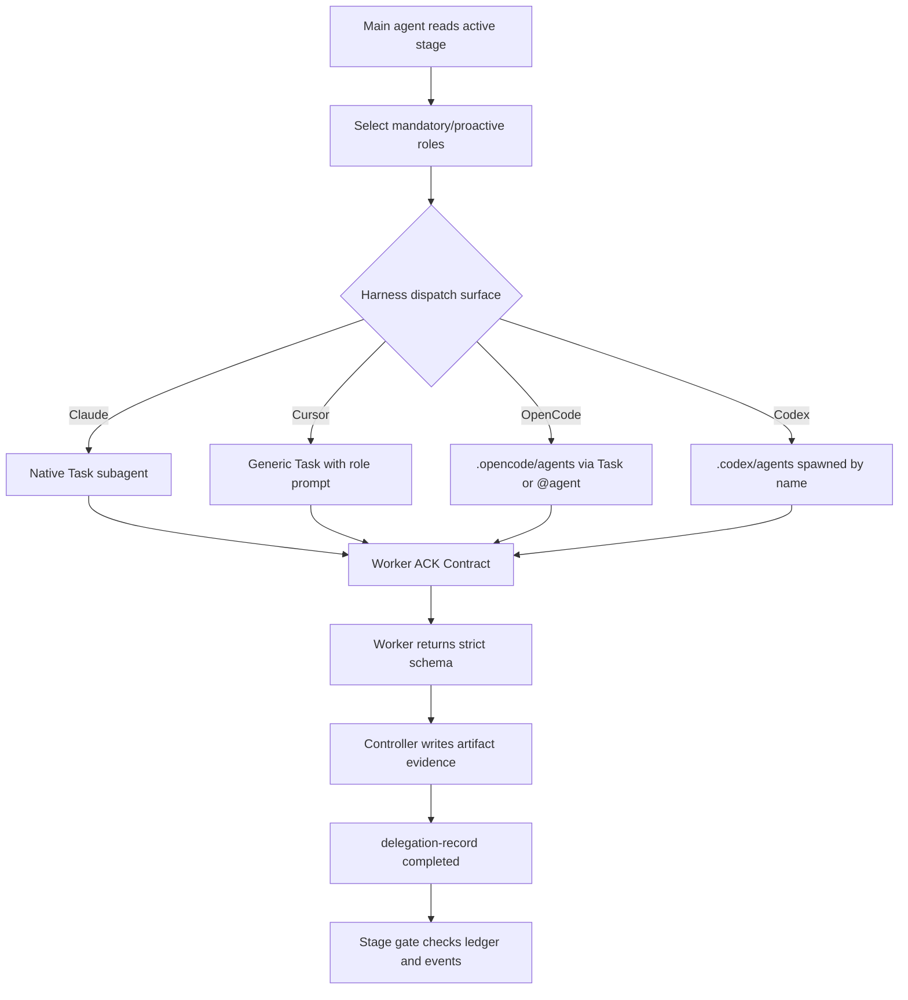
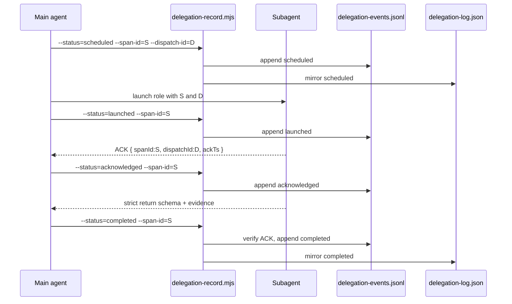

# Subagent Flow

This document describes the cclaw subagent dispatch model implemented by `src/delegation.ts`, `src/content/harness-doc.ts`, `src/content/skills.ts`, `src/content/subagents.ts`, and `src/harness-adapters.ts`. It complements `docs/harnesses.md`: that matrix lists harness capabilities and generated surfaces, while this page explains the lifecycle and proof model those surfaces must follow.

## Current Model

cclaw uses a parent controller plus bounded workers. The main agent owns stage state, reads `.cclaw/state/flow-state.json`, chooses the active stage skill, dispatches mandatory/proactive roles from the stage registry, reconciles results into the stage artifact, and advances only through generated helpers. Workers execute a pasted, self-contained role task and return strict evidence. They do not advance stages or recursively orchestrate other workers unless explicitly asked.

Harness capability comes from `HARNESS_ADAPTERS`:

| Harness | Dispatch model | Fulfillment mode | Proof source |
|---|---|---|---|
| Claude | native named Task subagent | `isolated` | delegation events plus ledger |
| Cursor | generic Task/Subagent with cclaw role prompt | `generic-dispatch` | events plus artifact `evidenceRefs` |
| OpenCode | generated `.opencode/agents/<agent>.md` via Task or `@agent` | `isolated` | generated agent file plus events |
| Codex | generated `.codex/agents/<agent>.toml` spawned by name | `isolated` | generated agent file plus events |

The runtime keeps three separate state layers: `.cclaw/state/delegation-events.jsonl` is append-only audit proof, `.cclaw/state/delegation-log.json` is the compact current ledger used by stage gates, and `.cclaw/state/subagents.json` is a lightweight active-worker tracker.

## Target Model

The target model is uniform, proof-backed delegation across all shipped harnesses. A controller records lifecycle rows with `.cclaw/hooks/delegation-record.mjs`, native/generic workers ACK before doing material work, and completion is rejected unless the same span has dispatch proof. Role-switch remains a degraded fallback, not the default for OpenCode or Codex.

## OpenCode Standard Flow

OpenCode has generated native agents and should not default to role-switch. In standard flow, the controller invokes the generated role through Task or an `@agent` mention, keeps independent lanes parallel only when their write sets do not overlap, and records lifecycle proof with the helper.

```mermaid
flowchart LR
  S[Stage skill dispatch table] --> P[Parent creates spanId and dispatchId]
  P --> R[Record scheduled]
  R --> T[Invoke .opencode/agents/role.md]
  T --> L[Record launched]
  L --> A[Worker ACK JSON]
  A --> Q[Record acknowledged]
  Q --> W[Worker result strict schema]
  W --> E[Parent writes evidence in artifact]
  E --> C[Record completed]
```

## Proof Sequence

A completed isolated or generic dispatch row is valid only when it has a `spanId`, dispatch identity (`dispatchId` or `workerRunId`), `dispatchSurface`, `agentDefinitionPath`, ACK proof, and completion timestamp. The generated helper now fails fast for isolated/generic `completed` calls unless the same span already has an `acknowledged` event, or the completed call carries `--ack-ts=<iso>`.

## Responsibilities

Main agent responsibilities:

- Load stage state, stage skill, command contract, and relevant upstream artifacts.
- Decide which agents run, whether parallelism is safe, and which harness dispatch surface applies.
- Generate stable `spanId` and `dispatchId` values and record `scheduled`, `launched`, `acknowledged`, and terminal events.
- Reconcile worker output into `.cclaw/artifacts/*`, preserve source tags/evidence anchors, and run stage gates.
- Use role-switch only as an explicit degradation path with non-empty `evidenceRefs`.

Subagent responsibilities:

- ACK first with `spanId`, `dispatchId` or `workerRunId`, `dispatchSurface`, `agentDefinitionPath`, `ackTs`, and `status: "ACK"`.
- Execute only the pasted role task and respect the role's tool/write posture.
- Return the strict schema required by generated agent instructions, including files inspected/changed, tests or verification, evidence refs, concerns, blockers, and the same dispatch proof.
- Avoid advancing stages, editing flow state directly, or launching more agents unless the parent explicitly delegates that orchestration.

## Parallelism Rules

Parallel dispatch is allowed for independent read-only research lanes and non-overlapping implementation/review lanes. The controller must serialize work when workers may touch the same module, when one lane's result changes another lane's assumptions, or when a failed lane would invalidate hidden premises. Fast agents may fan out in small groups; deep/high-risk decisions stay narrow and are reconciled by the parent.

## Current Gaps

- Cursor has real generic dispatch but no project-local named cclaw agents, so role prompts and evidence refs carry more of the proof burden.
- Codex hook coverage is limited for non-Bash tools; the generated skills and helper recipe provide the in-turn enforcement path.
- OpenCode/Codex native dispatch is prompt-level from the parent perspective, so dispatch IDs and ACK events are required to distinguish real workers from prose claims.
- Legacy ledgers remain readable, but rows that predate event-log proof are warnings rather than evidence for new isolated completions.

## Roadmap

- Add richer worker-state diagnostics in `/cc-view status` and doctor output, including stale ACK/launch age.
- Support multiple `--evidence-ref` values in the helper while preserving the compact ledger shape.
- Add optional harness-native task IDs when a runtime exposes them directly.
- Expand docs around mixed-harness installs and active-harness inference.
- Keep generated OpenCode/Codex agent schemas validated by doctor so missing or stale agent files are caught before dispatch.

## Relation to `docs/harnesses.md`

`docs/harnesses.md` is generated by `npm run build:harness-docs` from `src/content/harness-doc.ts` and should remain the capability matrix. This file is the narrative model for the same facts: how the main agent, generated workers, helper, event log, ledger, and stage gates fit together. When `src/harness-adapters.ts`, `src/content/skills.ts`, `src/content/subagents.ts`, or `src/content/hooks.ts` changes the dispatch contract, update both the generated harness doc source and this page.
