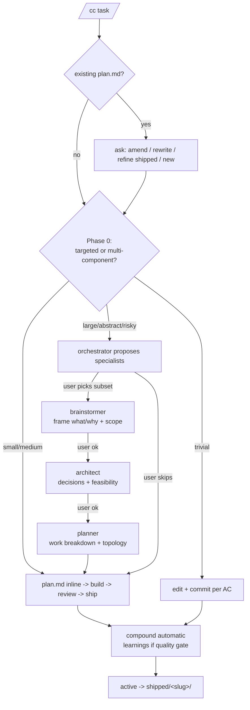

# cclaw v8.0 Vision

cclaw v8.0 is a breaking redesign. Goal: **lightweight default flow with depth on demand**. One conductor (`/cc`), six specialists used only when needed, durable artifacts, almost no runtime ceremony.

The 7.x mental model — many mandatory stages, large runtime state, ten-plus state files — is rejected. The valuable parts kept: plans with acceptance criteria, AC traceability to commits, artifacts that future agents and graph tools can index.

## Lock-in (final decisions)

| Area | v8 decision |
| --- | --- |
| `tdd` rename | `build` |
| `spec` rename | `plan` (artifact `plan.md`) |
| Stages | `plan`, `build`, `review`, `ship` (4) |
| Removed stage gates | `brainstorm`, `scope`, `design`, old `plan`, `tdd` as mandatory gates |
| AC traceability gate | Mandatory in default (only mandatory hook) |
| Slash commands | `/cc <task>`, `/cc-cancel`, `/cc-idea` (3 total). No `/cc-amend`, no `/cc-compound` |
| Public CLI | Installer/sync only; no `plan`, `status`, `ship`, or `migrate` flow commands |
| Specialists | 18 → 6 (-67%): brainstormer / architect / planner / reviewer (multi-mode) / security-reviewer / slice-builder. `doc-updater` is inline orchestrator. |
| Default specialist activation | `on-demand` for all six. No mandatory dispatch. |
| Discovery for large tasks | Sequential brainstormer → architect → planner with user checkpoint between each |
| Default posture | Trivial / small-medium runs inline; large/risky asks before specialist use |
| Phase 0 calibration | Single question: "targeted change in one place, or multi-component feature?" (EvanFlow pattern) |
| Iterate hard cap | 5 review/fix iterations, then stop and report (EvanFlow / DAPLab pattern) |
| Five Failure Modes | Hallucinated actions / scope creep / cascading errors / context loss / tool misuse — review checklist (DAPLab) |
| Auto-commit policy | per AC = auto via `commit-helper.mjs`. push and PR always ask. |
| Compound (learnings) | Automatic phase at end of `/cc` after ship. Quality gate before write. |
| Backward compat 7.x runs | Not supported. `/cc` rejects `schemaVersion: 1`. |
| npm 7.x | `npm deprecate cclaw-cli@"<8.0.0"` (community-friendly). Do not unpublish. |
| Memory palace | Archive 7.x knowledge as `wing: cclaw-7-legacy`, fresh writes under `wing: cclaw` |
| Karpathy 4 principles | Baked into `src/content/iron-laws.ts`: Think Before Coding / Simplicity First / Surgical Changes / Goal-Driven Execution |

## Final flow



Notes:

- At each specialist checkpoint user may stop and proceed with what's already in `plan.md`.
- Refinement (existing `plan.md` detected) goes through the same `/cc`, not a separate command.
- Compound is automatic at end of ship — user does not invoke it.
- Specialist parallelism applies only in review (code + security + adversarial on one diff) and in parallel-build (slice-builder × N + reviewer in integration mode).

## Phase 0 calibration

Every new `/cc <task>` first decides between:

1. **Trivial** — typo / format / rename / docs-only edit, ≤ 1 file, ≤ 30 lines diff, no architectural questions.
2. **Small / medium** — new functionality in 1-3 modules, 1-5 AC, no architectural questions.
3. **Large / abstract / risky** — > 5 AC, ambiguous prompt, architectural decision, security-sensitive, multi-component.

Calibration is a single short user question only when repository signals don't already settle it. It must not become a workshop.

## Specialists (6, all on-demand)

| Specialist | Modes | Purpose | Output |
| --- | --- | --- | --- |
| `brainstormer` | `frame`, `scope`, `alternatives` | Frame what/why, compare alternatives, bound scope | Updates `plan.md` Context / Frame / Scope / Alternatives |
| `architect` | `architecture`, `feasibility` | Architectural decisions and feasibility | Writes `decisions/<slug>.md`, links back to `plan.md` |
| `planner` | `research`, `work-breakdown`, `topology` | Work breakdown with AC, recommend execution topology | Updates `plan.md` Plan / Phases / Topology |
| `reviewer` | `code`, `text-review`, `integration`, `release`, `adversarial` | Review diffs, artifacts, integration, release readiness, adversarial risk | Writes `reviews/<slug>.md` findings with severity + AC refs |
| `security-reviewer` | `threat-model`, `sensitive-change` | Authentication, authorization, secrets, supply chain, data exposure | Adds security findings + sets `security_flag` for compound gate |
| `slice-builder` | `build`, `fix-only` | Bounded slice or post-review fix while preserving AC traceability | Updates `builds/<slug>.md`, commits referencing AC ids |

`doc-updater` is not a specialist. After build the orchestrator inline-checks docs/README/api notes; if the original task is doc-only, that is the default build path.

18 → 6 mapping (full):

| 18 v7 roles | v8 role | Note |
| --- | --- | --- |
| `researcher` | planner (mode=research) | research is part of planning |
| `planner` | planner | extended with breakdown + research + topology |
| `product-discovery` | brainstormer (mode=frame) | rename |
| `divergent-thinker` | brainstormer (mode=alternatives) | folded in |
| `scope-guardian-reviewer` | brainstormer (mode=scope) | scope = part of framing |
| `critic` | reviewer (mode=adversarial) | folded in |
| `architect` | architect | extended with feasibility |
| `feasibility-reviewer` | architect (mode=feasibility) | folded in |
| `spec-validator` | reviewer (mode=text-review) | folded in |
| `spec-document-reviewer` | reviewer (mode=text-review) | folded in |
| `coherence-reviewer` | reviewer (mode=text-review) | folded in |
| `reviewer` | reviewer | multi-mode |
| `security-reviewer` | security-reviewer | kept (different threat model expertise) |
| `integration-overseer` | reviewer (mode=integration) | folded in |
| `release-reviewer` | reviewer (mode=release) | folded in |
| `slice-builder` | slice-builder | extended with `fix-only` |
| `fixer` | slice-builder (mode=fix-only) | folded in |
| `doc-updater` | inline orchestrator | not a specialist |

## What we learned from 13 references

- **EvanFlow** — Phase 0 calibration question, "no skill tax", hard cap 5 iterations, "never auto-commit" pattern. We adopted Phase 0 + iteration cap; we relaxed "never auto-commit" to *commit-per-AC = auto, push/PR ask*.
- **Compound Engineering (Every Inc.)** — short-circuit when ceremony is unnecessary, automatic learnings capture. Adopted as automatic post-ship compound with quality gate.
- **Karpathy / forrestchang-karpathy** — four principles (Think Before / Simplicity / Surgical / Goal-Driven). Baked into `src/content/iron-laws.ts`.
- **DAPLab / Columbia (via EvanFlow)** — Five Failure Modes for review. Baked into `src/content/review-loop.ts`.
- **walkinglabs harness-engineering** — repo as system of record, init phase, victory detector, clean state per session. Validates our direction.
- **mattpocock-skills** — TDD as a family of files (validates the multi-mode reviewer approach).
- **gstack** — slash commands as entry, lightweight conductor, ~23 specialists. We collapse to 6, but adopt the conductor + on-demand specialists pattern.
- **addyosmani-skills** — markdown-first skills, auto-trigger pattern. Adopted for `.cclaw/skills/` and on-demand specialists.
- **obra-superpowers** — controller → coder → overseer pattern. We use it inside parallel-build (slice-builder × N + reviewer in integration mode).
- **anti-pattern: gsd-v2 / affaan-m-ecc** — v1 → heavy CLI trajectory. Do not repeat. Public CLI stays installer/sync only.
- **anti-pattern: giancarloerra-socraticode** — commercial CLA path. Not our case.
- **anti-pattern: superclaude / oh-my-claudecode / oh-my-codex** — ralph/swarm/pipeline that auto-execute without asking. Conflicts with "always ask" rule. Not adopted.
- **everyinc-compound** — explicit compound phase as an end-of-flow learning checkpoint. Adopted (with quality gate).

## What we do NOT take from references

- No automatic ralph/swarm loops (always-ask rule).
- No commercial CLA / harness-engineering rebrand.
- No heavy public CLI (gsd-v2 trajectory).
- No mandatory specialist dispatch (gstack rules everything from slash commands; we keep them on-demand).
- No `/cc-amend` / `/cc-compound` separate slash commands. Refinement and compound live inside `/cc`.

## Artifact policy (active vs shipped)

```
.cclaw/
  plans/<slug>.md         # ACTIVE: current work, AC list
  builds/<slug>.md        # ACTIVE: implementation log, AC<->commit chain
  reviews/<slug>.md       # ACTIVE: findings, Five Failure Modes pass
  ships/<slug>.md         # ACTIVE: release notes, push/PR refs
  decisions/<slug>.md     # ACTIVE: optional, written by architect
  learnings/<slug>.md     # ACTIVE: written automatically if quality gate passes
  state/
    flow-state.json       # minimal, ~500 bytes
  shipped/<slug>/         # COMPLETED: all artifacts moved here on ship
    plan.md
    build.md
    review.md
    ship.md
    decisions.md          (if architect was used)
    learnings.md          (if quality gate passed)
    manifest.md
  knowledge.jsonl         # cross-feature global learnings index
```

Active vs shipped policy:

- Active directories hold only current work.
- On successful ship, the orchestrator moves every `<slug>.md` from active dirs into `shipped/<slug>/`.
- No state snapshot is copied — runtime state has no value after ship.
- No timestamped folder; `<slug>` is unique. Chronology lives in git log + frontmatter `shipped_at`.
- `knowledge.jsonl` stays as a one-line-per-learning cross-feature index that points to shipped slugs.
- `learnings/<slug>.md` is per-feature detail and only exists when the quality gate is satisfied.

YAML frontmatter (minimum) for every artifact:

```yaml
---
slug: commission-approval-page
stage: plan | build | review | ship | shipped
status: active | shipped
ac:
  - id: AC-1
    text: "User sees approval status pill"
    commit: <sha-or-pending>
    status: pending | committed
last_specialist: brainstormer | architect | planner | null
refines: <old-slug-if-refinement>
shipped_at: <iso-or-null>
ship_commit: <sha-or-null>
review_iterations: 0
security_flag: false
---
```

Bodies must use explicit `AC-N`, `commit:<sha>`, `file:path:line` references where relevant. These are what Graphify and GitNexus index.

## Minimal flow-state schema (v8)

The only runtime state file is `.cclaw/state/flow-state.json`.

```ts
interface FlowStateV8 {
  schemaVersion: 2;
  currentSlug: string | null;
  currentStage: "plan" | "build" | "review" | "ship" | null;
  ac: Array<{
    id: string;
    text: string;
    commit?: string;
    status: "pending" | "committed";
  }>;
  lastSpecialist?: "brainstormer" | "architect" | "planner" | null;
  startedAt: string;
}
```

Removed fields (relative to 7.x): `activeRunId`, `completedStages`, `guardEvidence`, `stageGateCatalog`, `track`, `discoveryMode`, `skippedStages`, `staleStages`, `rewinds`, `interactionHints`, `retro`, `closeout`. Durable progress lives in artifacts, not in runtime state.

## Artifact diet (kill-list)

7.7.1 writes ~150 KB of runtime files to `.cclaw/state/` per project. v8 keeps one file.

| 7.x file | Decision |
| --- | --- |
| `state/flow-state.json` | KEEP, but compress to ~500 bytes (schema above). |
| `state/delegation-events.jsonl` | KILL. Specialists are on-demand; four-event lifecycle is gone. |
| `state/delegation-log.json` | KILL. Always empty. |
| `state/managed-resources.json` | KILL. Drift detection moves to install-time check. |
| `state/early-loop.json` + `state/early-loop-log.jsonl` | KILL. Q&A loop is removed. |
| `state/subagents.json` | KILL. Never used. |
| `state/compound-readiness.json` | KILL. Replaced by presence of `learnings/<slug>.md`. |
| `state/tdd-cycle-log.jsonl` | KILL. Empty in practice. |
| `state/iron-laws.json` | KILL. Static, lives in code. |
| `.linter-findings.json` | KILL persistent cache. Findings are in-memory per run. |
| `.flow-state.guard.json` | KILL. Sidecar checksum from 7.x mental model. |
| `.waivers.json` | KILL. No mandatory gates. |
| `archive/<date>-<slug>` | REPLACE with `shipped/<slug>/` (no state snapshot, no timestamp folder). |

State directory after the diet:

```
.cclaw/state/
  flow-state.json    # ~500 bytes
```

Total: 150 KB → 0.5 KB per project (-99.7%). 6238 LOC of state plumbing → ~600 LOC.

## Runtime vs install-time

v8 keeps runtime writes small and task-specific. Runtime may update only:

- `.cclaw/state/flow-state.json`
- active artifacts for the current slug
- `.cclaw/shipped/<slug>/` during ship
- `knowledge.jsonl` when the learning quality gate passes

Generated resource drift is install-time work. `cclaw install` and `cclaw sync` may compare generated assets, but normal `/cc` execution must not maintain `managed-resources.json`, guard sidecars, or persistent linter caches.

## 7.x run handling

v8 does not resume active 7.x runs. If `/cc` sees `schemaVersion: 1` in `.cclaw/state/flow-state.json`, it must stop and explain three operator choices:

1. Finish or archive the run with cclaw 7.x.
2. Abandon the run and delete `.cclaw/state/flow-state.json`.
3. Start a new v8 plan from the current code state.

There is no automatic migration because old runtime state is mostly ceremony, not durable project knowledge.

## Compound and learning capture

Compound runs automatically at the end of `/cc` after ship. It writes `learnings/<slug>.md` only when at least one signal is present:

- A non-trivial decision was recorded by `architect` or `planner`.
- Review needed three or more iterations.
- A security review ran or `security_flag` was true.
- The user explicitly asked for capture.

If no signal is present, no learning is written — this protects `knowledge.jsonl` from low-value noise.

When the gate passes, compound:

1. Writes `.cclaw/learnings/<slug>.md` with Graphify-friendly frontmatter.
2. Appends one line to `.cclaw/knowledge.jsonl` referencing the shipped slug + `ship_commit`.
3. Links plan/build/review/commits via the slug.
4. Then performs the active → shipped move.

## Iteration discipline (Five Failure Modes)

Review checks five failure modes (DAPLab):

- **Hallucinated actions** — invented files, env vars, IDs, function names, or commands.
- **Scope creep** — changes outside declared AC.
- **Cascading errors** — one fix creates new failures.
- **Context loss** — earlier decisions or constraints are forgotten.
- **Tool misuse** — tool calls in the wrong mode or without understanding effects.

Hard cap: stop after 5 review / fix iterations and report remaining blockers.

## Commit and push policy

- One commit per AC is allowed and encouraged. `commit-helper.mjs` checks AC traceability and creates the commit.
- `git push` and PR creation always require explicit user approval. Agents must ask in the current turn.
- This is more permissive than EvanFlow's "never auto-commit" rule, by design — commit-per-AC is safe and expected.

## Sizing target

| Metric | 7.7.1 | v8.0 |
| --- | --- | --- |
| LOC `src/` | ~46 583 | ~4 000 (-91%) |
| LOC state plumbing | ~6 238 | ~600 (-90%) |
| Stage gates | ~30 | 3 (AC traceability) |
| Tests | 1247 | ~350 |
| Specialists | 18 | 6 (-67%) |
| Slash commands | 4 (planned) | 3 |
| Mandatory hooks | 5 | 1 (commit-helper) |
| Default hook profile | `standard` | `minimal` |
| `.cclaw/state/` files | 9 | 1 (-89%) |
| `.cclaw/state/` size | ~150 KB | ~0.5 KB (-99.7%) |
| Hidden files | `.linter-findings.json`, `.flow-state.guard.json`, `.waivers.json` | none |
| Archive size per shipped feature | ~600 KB (state snapshot) | ~30 KB (artifact move only, -95%) |
| Time to first commit (medium task) | ~10 min | ~30 s |

## Migration from 7.x

v8 is breaking. There is no automatic migration. See `docs/migration-v7-to-v8.md` for the recommended path.

Manual operator steps:

```bash
# inside the project that used 7.x
npx cclaw-cli@8.0.0 sync
# decide whether to finish or abandon any active 7.x run
rm -f .cclaw/state/flow-state.json   # only after deciding the old run is done
```

Maintainer release tasks (intentionally manual):

```bash
npm publish
npm deprecate cclaw-cli@"<8.0.0" "8.0 is a breaking redesign. See docs/migration-v7-to-v8.md."
git push origin feat/v8-core --tags
```

## Risks (and mitigation)

- **M2 chain reaction**: aggressive `rg` before each removal, build/test green after each major deletion.
- **managed-resources removal**: drift checks move to `cclaw install`. Documented in `docs/migration-v7-to-v8.md`.
- **flow-state schema migration without backward compat**: `/cc` checks `schemaVersion`; if `1` it surfaces the operator choices above.
- **archive → shipped rename**: dogfood projects keep the existing `.cclaw/archive/` until they decide to remove it.
- **Compound quality-gate false negatives**: explicit user override `/cc ... --capture-learnings` always wins.
- **18 → 6 specialist merge**: edge-case checks from `feasibility-reviewer` / `coherence-reviewer` are preserved as explicit prompt sections in the merged roles.
- **M6 routing complexity**: 7 smoke tests for typical scenarios + frontmatter spec keep refinement deterministic.
- **Memory palace migration**: rename is not exposed by MCP. We use `V8_START_MARKER` (in `wing: cclaw`) and `ARCHIVE_MARKER` (in `wing: cclaw-7-legacy`) as the logical boundary; no drawer is destroyed.
- **Karpathy iron-laws collision**: M0 explicitly replaces existing iron laws with the four principles.
